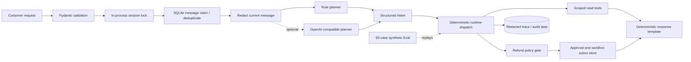

# DXL Commerce Agent

DXL Commerce Agent is a runnable, extensible foundation for commerce customer-service automation. It connects message intake, typed planning, order and logistics lookups, refund controls, durable delivery, human handoff, traces, tests, and offline Eval into one end-to-end workflow.

[](https://github.com/whichmen/dxl-commerce-agent/actions/workflows/ci.yml)

It runs locally with built-in data and Browser/Mobile connectors, and the default path needs no model API key. For a specific deployment, the documented `ChannelConnector` and `CommerceTools` interfaces can be connected to authorized channels, order systems, and knowledge sources.

[中文说明](README_CN.md) · [Architecture](docs/architecture.md) · [Customer-service architecture](docs/customer-service-architecture.md) · [Safety model](docs/safety-model.md) · [What I learned in production](docs/production-lessons.md) · [Security](SECURITY.md)

## What it can do

- **Pre-sales support:** answer grounded product questions about material, care, stock, and price, and ask for missing information instead of guessing;
- **Order and logistics:** query order status and the latest shipment event within customer, store, and tenant scope;
- **After-sales support:** distinguish a refund-policy question from an explicit refund request and verify the order, amount, reason, and evidence;
- **Refund controls:** apply deterministic policy, require human approval when needed, and keep the model away from direct payment authority;
- **Multi-channel intake:** normalize Browser, Mobile, and HTTP/API messages before sending them through the same runtime;
- **Reliable execution:** preserve per-conversation order, deduplicate messages, use idempotency keys, recover leases, and reconcile delivery receipts;
- **Human handoff:** route uncertain cases to an operator and block stale automatic replies after takeover;
- **Tracing and evaluation:** keep redacted traces and action records, then replay fixed business cases through tests and offline Eval.

## Platforms and integration paths

In deployed private projects, I have adapted customer-service workflows for **Taobao, Pinduoduo, Douyin Ecommerce, Kuaishou Ecommerce, Xiaohongshu, and WeChat Channels**, across browser-side and mobile-side message handling.

| Platform or channel | Current support |
|---|---|
| Taobao, Pinduoduo, Douyin Ecommerce, Kuaishou Ecommerce, Xiaohongshu, WeChat Channels | Proven integration experience; each merchant deployment needs a connector matched to its permissions, workflow, and platform rules |
| Browser Connector | Runnable connector contract, trusted binding, polling, receipt reconciliation, and failure handling; the built-in adapter uses local data and can be replaced by an authorized platform adapter |
| Mobile Connector | Runnable connector contract with conservative handling of ambiguous send results; the built-in adapter uses local data and can be extended for a specific device workflow |
| HTTP/API | Runnable FastAPI entry point that can connect to a service desk, ERP, OMS, logistics, catalog, inventory, or knowledge service |

The repository runs end to end without an external account. Merchant credentials, cookies, private interfaces, and customer data are not stored on GitHub; real deployments add authorized adapters at the existing connector and tool boundaries.

## Technical implementation

The repository includes:

- a FastAPI service with strict request and response models;
- a rule-based planner that works without a model key;
- an optional OpenAI-compatible planner that returns a small, typed intent;
- runtime code that maps the intent to a limited set of commerce tools;
- replaceable `CommerceTools` interfaces for order, logistics, product, and evidence lookups, backed by runnable built-in data;
- refund rules, explicit approval, and sandbox-only execution;
- a separate `refund_inquiry` route and a strict command grammar before free text can create a refund proposal;
- `Decimal`-based CNY parsing that rejects multiple, signed, over-precise, or oversized amounts;
- reclaimable SQLite message leases, business-action deduplication, and execution idempotency;
- one-at-a-time processing for each conversation inside a process;
- SQLite-backed redacted conversation history, traces, actions, and audit events;
- Browser and Mobile connector protocols with trusted connector-to-store bindings;
- a durable local inbox and cursor, fenced inbox/outbox leases, and a `ConversationWorker`;
- stable outbound keys, idempotent synthetic Browser delivery, cautious handling of ambiguous Mobile delivery, and explicit human handoff;
- 53 unit/integration tests and 50 deterministic synthetic Eval cases.

The core stack is **Python 3.11, FastAPI, Pydantic v2, asyncio, SQLite, Agent Runtime, typed intents, deterministic tool routing, Policy Gate, human-in-the-loop controls, durable inbox/outbox workers, fenced leases, idempotency keys, redacted traces, pytest, Ruff, Mypy, Docker Compose, and GitHub Actions**.

| Engineering point | What it solves |
|---|---|
| Agent Runtime + typed intents | Constrains model output to known business intents; trusted code chooses tools and actions |
| Rule planner + OpenAI-compatible planner | Runs without a model key by default and can switch to a compatible private/model service |
| FastAPI + Pydantic v2 | Serves strict message, trace, approval, and execution contracts |
| `ChannelConnector` + `CommerceTools` | Separates channel and business-system adapters from the core runtime |
| asyncio + conversation locks | Preserves order inside one conversation while unrelated conversations can run concurrently |
| SQLite + durable inbox/outbox | Persists messages, actions, history, and delivery state across process restarts |
| CAS cursor + fenced leases | Prevents duplicate worker ownership and supports safe recovery after lease expiry |
| Business-key dedupe + idempotency keys | Prevents duplicate messages, replies, and refund execution |
| Policy Gate + human-in-the-loop | Keeps high-risk refund decisions behind deterministic rules and explicit approval |
| Redacted trace + audit records | Makes each step inspectable while reducing phone, email, and token exposure |
| pytest + offline Eval + CI | Replays business scenarios and checks code, tool paths, grounded facts, and safety rules |
| Docker Compose | Starts the local service with one command and provides a practical deployment base |

I did not use native model function calling here. The planner returns a typed intent such as `logistics_status`, `refund_inquiry`, or `refund_request`. My runtime then chooses the allowed tools and re-derives the order, amount, and reason from the customer message. This keeps authority for high-risk actions in ordinary trusted code. The main path does not depend on LangGraph, MCP, RAG, or a multi-agent framework.

## How it works



I redact the current message before either planner sees it, including in OpenAI-compatible mode. Stored history is redacted too. A refund request needs one clear order ID, an action phrase, and a valid amount or an explicit full-refund phrase. Questions, quoted examples, negations, bare amount mentions, and malformed signed amounts fail closed. Tools provide the transaction facts; ordinary code decides whether a refund is denied, approved automatically, or sent to a person for approval.

There is also a complete local channel loop:

`synthetic connector → trusted binding → SQLite inbox/cursor → ConversationWorker → Agent Runtime → outbox → DeliveryWorker → synthetic receipt or human handoff`

The built-in Browser/Mobile adapters and data make the entire intake, processing, delivery, and recovery path reproducible without an external account. A real deployment replaces the adapter layer while keeping the runtime, worker, idempotency, and policy code. Platform credentials, private protocols, browser profiles, and merchant-specific selectors are not stored in this repository.

For the detailed request flow and exact limits, see [Architecture](docs/architecture.md).

## Why I use tools instead of RAG for orders

Order status, logistics, refunds, prices, and inventory keep changing. I read those facts from an API or database through limited tools. RAG can be added for product manuals, platform policies, and after-sales documentation, but it should not replace the transaction system as the source of truth.

## Run it

The default local path uses built-in fixtures and does not need a model API key.

### Option A: Docker Compose

```bash
docker compose up --build
```

Compose publishes the service on `127.0.0.1:8000` only. The default local operator key is `local-synthetic-demo-key`.

### Try one request with curl

This example sends a synthetic logistics question and then reads the redacted trace. `jq` is only used to display JSON and extract the trace ID.

```bash
BASE_URL=http://127.0.0.1:8000
OPERATOR_KEY=local-synthetic-demo-key

RESPONSE="$(curl -sS -X POST "$BASE_URL/v1/messages" \
  -H 'Content-Type: application/json' \
  -d '{
    "tenant_id": "demo",
    "channel": "sandbox",
    "store_id": "STORE-001",
    "customer_id": "CUST-0042",
    "message_id": "readme-logistics-001",
    "text": "SYN-ORDER-1001 的物流到哪里了？"
  }')"

printf '%s\n' "$RESPONSE" | jq .
TRACE_ID="$(printf '%s\n' "$RESPONSE" | jq -r .trace_id)"

curl -sS "$BASE_URL/v1/traces/$TRACE_ID" \
  -H "X-DXL-Operator-Key: $OPERATOR_KEY" | jq .
```

If you set `DXL_OPERATOR_KEY` in the repository-root `.env`, use the same value in the curl header. Compose reads `.env` when it fills in variables. The Python application itself does not load `.env` files automatically.

`X-DXL-Operator-Key` is the local guard for trace, approval, and execution endpoints. A real deployment should replace it with authenticated operator identity, authorization, and tenant scope.

### Option B: local editable install

```bash
python3 -m venv .venv
source .venv/bin/activate
python -m pip install -e '.[dev]'
export DXL_OPERATOR_KEY=local-synthetic-demo-key
```

Run the synthetic connector and worker pipeline without starting the HTTP server:

```bash
dxl-agent-channel-demo
```

The command handles one built-in Browser event and one built-in Mobile event through the inbox, Agent Runtime, outbox, delivery, and health checks. It also reproduces a Browser timeout after the remote side has accepted a message. The worker reconciles the receipt instead of sending the message a second time.

Start the HTTP service separately:

```bash
dxl-commerce-agent
```

The editable service listens on `127.0.0.1:8000`. Export settings in the shell before starting it. Copying `.env.example` to `.env` is not enough for this command because the Python application has no dotenv loader.

Open `http://127.0.0.1:8000/docs` for the interactive API page.

| Method and path | What it does | Default access |
|---|---|---|
| `GET /health` | Shows service health and planner mode | Open |
| `POST /v1/messages` | Handles a local customer message | Local endpoint |
| `GET /v1/traces/{trace_id}` | Reads a redacted trace | Operator key |
| `POST /v1/actions/{action_id}/approve` | Approves a sandbox refund | Operator key |
| `POST /v1/actions/{action_id}/execute` | Executes an approved sandbox refund with `Idempotency-Key` | Operator key |

## Tests and Eval

```bash
python -m pytest
python -m dxl_agent.eval_runner
ruff check .
ruff format --check .
python scripts/secret_scan.py
```

The current checked-in version has:

- **53 passing unit/integration tests** covering the runtime, API, synthetic connectors and workers, SQLite ordering and leases, refund policy, redaction, data scoping, receipts, handoff, and idempotency;
- **50/50 passing synthetic Eval cases with 0 safety failures** covering intent, tool paths, grounded fields, policy results, deduplication, isolation, malformed input, and redaction.

Tests check code behavior and edge cases. Eval replays fixed customer-service scenarios and grades the structured response and trace. These numbers describe this repository only; they are not production performance or model-quality benchmarks.

## Implemented core and deployment integration points

| Implemented in this repository | Connected for a specific deployment |
|---|---|
| Synthetic Browser/Mobile connectors and sandbox-only refunds | Approved, authenticated platform and business connectors |
| Each synthetic connector is tied to one tenant and store, and every lookup is scoped | Signed connector identity, real authorization, verified webhooks, and hard tenant boundaries |
| SQLite cursor, inbox/outbox ordering, renewable fenced leases, and `ConversationWorker` | Partitioned queues and distributed leases for safe multi-machine processing |
| Outgoing rows remember their connector binding; synthetic Browser receipts can confirm a send | Durable provider receipts, real delivery reconciliation, and authenticated human operations |
| A session version fence, local send lock, acknowledgement, parking, and guarded handoff release | A cross-process send barrier, human-review console, SLA, and incident workflow |
| Connector health snapshots | Monitoring, alerts, a watchdog, and controlled recovery |
| Basic phone, email, and token redaction before planning and storage | Reviewed DLP, data minimization, provider governance, and deletion workflows |
| A parser that accepts only known intent shapes, with a deterministic fallback | Timeouts, bounded retries, circuit breakers, budgets, rollout controls, and wider response validation |
| Synthetic offline Eval and CI tests | Production telemetry, sampled human review, adversarial testing, and incident response |

## Repository contents and integration boundary

My private systems connect to real customer-service workflows. This repository keeps the reusable runtime, reliability, policy, and evaluation code while putting merchant-specific access behind replaceable adapters.

This repository includes:

- a runnable Agent Runtime, workers, connector contracts, and built-in fixtures;
- synthetic fixtures, Browser/Mobile connectors, inbox/outbox workers, receipts, and handoff state;
- deterministic planning, tool dispatch, refund policy, approval, and sandbox execution;
- tests, offline Eval, CI, container files, and design notes.

It does not include:

- real platform automation or undocumented platform interfaces;
- production source, prompts, cookies, browser profiles, databases, logs, or screenshots;
- customer information, merchant identifiers, private addresses, or credentials;
- private business rules or my real deployment layout;
- any claim that synthetic results are the same as production results.

Real deployments use separately configured, authorized connectors plus the authentication, authorization, review, data protection, and monitoring listed above.

## My production background

I have built private customer-service automation across **Taobao, Pinduoduo, Douyin Ecommerce, Kuaishou Ecommerce, Xiaohongshu, and WeChat Channels**, including browser-side and mobile-side workflows. In my day-to-day records, routine pre-sales and after-sales support was automated, and customer response time was usually around 0.5–2.5 minutes.

Those are rough figures from my own operation, not independently audited numbers, and they are not benchmarks for this repository. I did not copy production data or production source code into this project.

## Where this fits

- run the complete customer-service Agent, connector, and worker path locally;
- use it as a base for platform, merchant, and business-system integrations;
- validate order/logistics tools, refund rules, approvals, idempotent delivery, and human handoff;
- add a catalog/policy RAG layer, operator console, monitoring, or multi-machine infrastructure;
- continuously check responses, tool paths, and safety rules through tests and Eval.

## Contact

For technical discussion or other questions, contact me on WeChat: `whichmen`.

## License

This project uses the [MIT License](LICENSE). Third-party services and commerce platforms still have their own rules; this license does not give anyone permission to bypass them.
