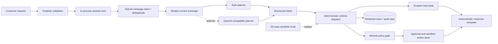

# DXL Commerce Agent

This is a runnable customer-service Agent project I built for my portfolio. It shows how I handle the parts around an LLM that actually matter in a real system: message intake, tool calls, order and logistics lookups, refund checks, duplicate prevention, delivery retries, human handoff, traces, tests, and Eval.

[](https://github.com/whichmen/dxl-commerce-agent/actions/workflows/ci.yml)

> [!IMPORTANT]
> I rebuilt this public version from scratch so people can read it, run it, and discuss the design with me. It is not a copy of my private production code. All customers, stores, orders, policies, conversations, credentials, connectors, and Eval cases in this repository are synthetic.

[中文说明](README_CN.md) · [Architecture](docs/architecture.md) · [Customer-service architecture](docs/customer-service-architecture.md) · [Safety model](docs/safety-model.md) · [What I learned in production](docs/production-lessons.md) · [Security](SECURITY.md)

## What I built

This is more than a chatbot demo. The repository includes:

- a FastAPI service with strict request and response models;
- a rule-based planner that works without a model key;
- an optional OpenAI-compatible planner that returns a small, typed intent;
- runtime code that maps the intent to a limited set of commerce tools;
- synthetic order, logistics, product, and evidence lookups;
- refund rules, explicit approval, and sandbox-only execution;
- a separate `refund_inquiry` route and a strict command grammar before free text can create a refund proposal;
- `Decimal`-based CNY parsing that rejects multiple, signed, over-precise, or oversized amounts;
- reclaimable SQLite message leases, business-action deduplication, and execution idempotency;
- one-at-a-time processing for each conversation inside a process;
- SQLite-backed redacted conversation history, traces, actions, and audit events;
- newly written Browser and Mobile simulators with synthetic events and connector-to-store bindings;
- a durable local inbox and cursor, fenced inbox/outbox leases, and a `ConversationWorker`;
- stable outbound keys, idempotent synthetic Browser delivery, cautious handling of ambiguous Mobile delivery, and explicit human handoff;
- 53 unit/integration tests and 50 deterministic synthetic Eval cases.

I did not use native model function calling here. The planner returns a typed intent such as `logistics_status`, `refund_inquiry`, or `refund_request`. My runtime then chooses the allowed tools and reads the order, amount, and reason from the customer message. The main path also does not depend on LangGraph, MCP, RAG, or a multi-agent framework.

## How it works



I redact the current message before either planner sees it, including in OpenAI-compatible mode. Stored history is redacted too. A refund request needs one clear order ID, an action phrase, and a valid amount or an explicit full-refund phrase. Questions, quoted examples, negations, bare amount mentions, and malformed signed amounts fail closed. Tools provide the transaction facts; ordinary code decides whether a refund is denied, approved automatically, or sent to a person for approval.

There is also a complete local channel loop:

`synthetic connector → trusted binding → SQLite inbox/cursor → ConversationWorker → Agent Runtime → outbox → DeliveryWorker → synthetic receipt or human handoff`

This loop is useful for testing worker behavior, but the connectors are synthetic. The repository does not contain a real platform protocol, account, browser profile, device-control script, selector, or private connector.

For the detailed request flow and exact limits, see [Architecture](docs/architecture.md).

## Why I use tools instead of RAG for orders

Order status, logistics, refunds, prices, and inventory keep changing. I read those facts from an API or database through limited tools. RAG is useful for large collections of documents such as product manuals or platform policies, but I would not use it as the source of truth for a transaction. That is why RAG is an optional future addition rather than a requirement in this demo.

## Run it

The default demo uses synthetic fixtures and does not need a model API key.

### Option A: Docker Compose

```bash
docker compose up --build
```

Compose publishes the service on `127.0.0.1:8000` only. The default demo operator key is `local-synthetic-demo-key`.

### Try one request with curl

This example sends a synthetic logistics question and then reads the redacted trace. `jq` is only used to display JSON and extract the trace ID.

```bash
BASE_URL=http://127.0.0.1:8000
OPERATOR_KEY=local-synthetic-demo-key

RESPONSE="$(curl -sS -X POST "$BASE_URL/v1/messages" \
  -H 'Content-Type: application/json' \
  -d '{
    "tenant_id": "demo",
    "channel": "sandbox",
    "store_id": "STORE-001",
    "customer_id": "CUST-0042",
    "message_id": "readme-logistics-001",
    "text": "SYN-ORDER-1001 的物流到哪里了？"
  }')"

printf '%s\n' "$RESPONSE" | jq .
TRACE_ID="$(printf '%s\n' "$RESPONSE" | jq -r .trace_id)"

curl -sS "$BASE_URL/v1/traces/$TRACE_ID" \
  -H "X-DXL-Operator-Key: $OPERATOR_KEY" | jq .
```

If you set `DXL_OPERATOR_KEY` in the repository-root `.env`, use the same value in the curl header. Compose reads `.env` when it fills in variables. The Python application itself does not load `.env` files automatically.

`X-DXL-Operator-Key` is only a simple guard for this local demo's trace, approval, and execution endpoints. It is not real authentication or authorization.

### Option B: local editable install

```bash
python3 -m venv .venv
source .venv/bin/activate
python -m pip install -e '.[dev]'
export DXL_OPERATOR_KEY=local-synthetic-demo-key
```

Run the synthetic connector and worker pipeline without starting the HTTP server:

```bash
dxl-agent-channel-demo
```

The demo handles one synthetic Browser event and one synthetic Mobile event through the inbox, Agent Runtime, outbox, delivery, and health checks. It also simulates a Browser timeout after the remote side has accepted a message. The worker checks the synthetic receipt instead of sending the message a second time.

Start the HTTP service separately:

```bash
dxl-commerce-agent
```

The editable service listens on `127.0.0.1:8000`. Export settings in the shell before starting it. Copying `.env.example` to `.env` is not enough for this command because the Python application has no dotenv loader.

Open `http://127.0.0.1:8000/docs` for the interactive API page.

| Method and path | What it does | Demo access |
|---|---|---|
| `GET /health` | Shows service health and planner mode | Open |
| `POST /v1/messages` | Handles a synthetic customer message | Open demo endpoint |
| `GET /v1/traces/{trace_id}` | Reads a redacted trace | Demo operator key |
| `POST /v1/actions/{action_id}/approve` | Approves a sandbox refund | Demo operator key |
| `POST /v1/actions/{action_id}/execute` | Executes an approved sandbox refund with `Idempotency-Key` | Demo operator key |

## Tests and Eval

```bash
python -m pytest
python -m dxl_agent.eval_runner
ruff check .
ruff format --check .
python scripts/secret_scan.py
```

The current checked-in version has:

- **53 passing unit/integration tests** covering the runtime, API, synthetic connectors and workers, SQLite ordering and leases, refund policy, redaction, data scoping, receipts, handoff, and idempotency;
- **50/50 passing synthetic Eval cases with 0 safety failures** covering intent, tool paths, grounded fields, policy results, deduplication, isolation, malformed input, and redaction.

Tests check code behavior and edge cases. Eval replays fixed customer-service scenarios and grades the structured response and trace. These numbers describe this repository only; they are not production performance or model-quality benchmarks.

## What is real here, and what is still a demo

| In this repository | What I would add before a real deployment |
|---|---|
| Synthetic Browser/Mobile connectors and sandbox-only refunds | Approved, authenticated platform and business connectors |
| Each synthetic connector is tied to one tenant and store, and every lookup is scoped | Signed connector identity, real authorization, verified webhooks, and hard tenant boundaries |
| SQLite cursor, inbox/outbox ordering, renewable fenced leases, and `ConversationWorker` | Partitioned queues and distributed leases for safe multi-machine processing |
| Outgoing rows remember their connector binding; synthetic Browser receipts can confirm a send | Durable provider receipts, real delivery reconciliation, and authenticated human operations |
| A session version fence, local send lock, acknowledgement, parking, and guarded handoff release | A cross-process send barrier, human-review console, SLA, and incident workflow |
| Connector health snapshots | Monitoring, alerts, a watchdog, and controlled recovery |
| Basic phone, email, and token redaction before planning and storage | Reviewed DLP, data minimization, provider governance, and deletion workflows |
| A parser that accepts only known intent shapes, with a deterministic fallback | Timeouts, bounded retries, circuit breakers, budgets, rollout controls, and wider response validation |
| Synthetic offline Eval and CI tests | Production telemetry, sampled human review, adversarial testing, and incident response |

## Why the public version is sanitized

My private system connects to real customer-service workflows. Publishing that code as-is would expose details that do not belong on GitHub and could also break platform rules. I kept the architecture and the difficult engineering problems, then replaced the private pieces with runnable synthetic ones.

This repository includes:

- code I wrote specifically for this public demo;
- synthetic fixtures, Browser/Mobile connectors, inbox/outbox workers, receipts, and handoff state;
- deterministic planning, tool dispatch, refund policy, approval, and sandbox execution;
- tests, offline Eval, CI, container files, and design notes.

It does not include:

- real platform automation or undocumented platform interfaces;
- production source, prompts, cookies, browser profiles, databases, logs, or screenshots;
- customer information, merchant identifiers, private addresses, or credentials;
- private business rules or my real deployment layout;
- any claim that synthetic results are the same as production results.

Please do not point this demo at real accounts, customer data, or payment authority. Those need the real authentication, authorization, review, and monitoring listed above.

## My production background

I designed this public project around problems I had already dealt with while running a private commerce-support automation system. That private system supported more than ten stores. In my own day-to-day records, customer response time was usually around 0.5–2.5 minutes, and the overall labor cost was reduced by about half.

Those are rough figures from my own operation, not independently audited numbers, and they are not benchmarks for this repository. I did not copy production data or production source code into this project.

## Contact

If you want to discuss an Agent/FDE role or a related project, my WeChat is `whichmen`.

## License

This project uses the [MIT License](LICENSE). Third-party services and commerce platforms still have their own rules; this license does not give anyone permission to bypass them.
