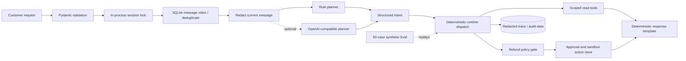

# DXL Commerce Agent

A privacy-safe, production-minded commerce-support agent reference implementation.

[](https://github.com/whichmen/dxl-commerce-agent/actions/workflows/ci.yml)

> [!IMPORTANT]
> This is a **fresh, sanitized reference implementation** built for architecture review and portfolio demonstration. It is not a source dump, mirror, or historical snapshot of the author's private production system. Every customer, store, order, policy, conversation, credential placeholder, and evaluation case in this repository is synthetic.

[中文说明](README_CN.md) · [Architecture](docs/architecture.md) · [Customer-service target architecture](docs/customer-service-architecture.md) · [Safety model](docs/safety-model.md) · [Production lessons](docs/production-lessons.md) · [Security](SECURITY.md)

## What is implemented

The repository demonstrates the engineering around a model, rather than presenting a chatbot-only demo:

- a FastAPI service with strict request and response models;
- a deterministic rule planner that runs without a model key;
- an optional OpenAI-compatible planner that returns a closed, structured intent;
- deterministic runtime dispatch from that intent to scoped commerce tools;
- synthetic order, logistics, product, and evidence lookups;
- deterministic refund policy, explicit approval, and sandbox-only execution;
- a separate `refund_inquiry` route plus a fail-closed, anchored command grammar before free text may create a sandbox refund proposal;
- strict `Decimal`-based CNY parsing that rejects multiple, signed, over-precise, or oversized amounts;
- reclaimable SQLite message leases, business-action deduplication, and execution idempotency;
- per-session serialization within one process;
- SQLite-backed dialogue history, redacted traces, actions, and selected audit events;
- clean-room synthetic Browser and Mobile connectors with trusted deployment bindings;
- a local durable SQLite inbox/cursor, fenced inbox/outbox leases, and `ConversationWorker`;
- a stable-key outbound outbox, idempotent synthetic Browser delivery, conservative Mobile ambiguity handling, and explicit human-handoff state;
- 53 unit/integration tests and 50 deterministic synthetic Eval cases.

This implementation does **not** use native model function calling. The planner emits a typed intent such as `logistics_status`, `refund_inquiry`, or `refund_request`; trusted runtime code then chooses the allowed tools and derives the refund order, amount, and policy-relevant reason from the customer message. It also does not require LangGraph, MCP, RAG, or multi-agent orchestration.

## Architecture at a glance



The current customer message is redacted before either planner sees it, including in OpenAI-compatible mode. Stored recent history is redacted as well. A refund write path requires one explicit order ID, an anchored action phrase, and a strict amount (or explicit full-refund phrase); questions, quoted examples, negations, bare amount mentions, and malformed signed amounts fail closed. Transaction facts come from scoped synthetic tools, while policy code—not model prose—decides whether a refund proposal is denied, automatically approved, or held for operator approval.

The optional clean-room channel path exercises the larger delivery loop: synthetic connector polling → trusted binding → SQLite inbox/cursor → `ConversationWorker` → the same single Agent Runtime → outbox → `DeliveryWorker` → synthetic receipt or human handoff. It contains no real platform protocol, account, browser profile, device automation, or private connector code.

See [Architecture](docs/architecture.md) for the exact request lifecycle and implementation boundaries.

## Why tools instead of RAG for orders

Orders, logistics, refund status, prices, and inventory are mutable structured facts. They should come from an authoritative API or database through scoped tools. RAG can be useful for large unstructured corpora such as manuals or platform policies, but it should not replace a transactional system. RAG is therefore a possible production extension, not part of this repository's required path.

## Quick start

The default demo is deterministic, uses only synthetic fixtures, and needs no model API key.

### Option A: Docker Compose

```bash
docker compose up --build
```

Compose publishes the service only on `127.0.0.1:8000`; it is not exposed on every host interface. By default, Compose supplies the demo operator key `local-synthetic-demo-key`.

### 60-second curl walkthrough

This sends a synthetic logistics question and then reads its redacted trace. `jq` is used only to display the JSON and extract the trace ID.

```bash
BASE_URL=http://127.0.0.1:8000
OPERATOR_KEY=local-synthetic-demo-key

RESPONSE="$(curl -sS -X POST "$BASE_URL/v1/messages" \
  -H 'Content-Type: application/json' \
  -d '{
    "tenant_id": "demo",
    "channel": "sandbox",
    "store_id": "STORE-001",
    "customer_id": "CUST-0042",
    "message_id": "readme-logistics-001",
    "text": "SYN-ORDER-1001 的物流到哪里了？"
  }')"

printf '%s\n' "$RESPONSE" | jq .
TRACE_ID="$(printf '%s\n' "$RESPONSE" | jq -r .trace_id)"

curl -sS "$BASE_URL/v1/traces/$TRACE_ID" \
  -H "X-DXL-Operator-Key: $OPERATOR_KEY" | jq .
```

If you set `DXL_OPERATOR_KEY` in a repository-root `.env`, use that same value in the curl header. Docker Compose reads `.env` for variable interpolation. The Python application itself does **not** load `.env` files automatically.

`X-DXL-Operator-Key` is only a shared demo guard for trace, approval, and execution endpoints. It is not production identity authentication, user authorization, tenant authentication, or a replacement for signed webhooks/OIDC.

### Option B: local editable install

```bash
python3 -m venv .venv
source .venv/bin/activate
python -m pip install -e '.[dev]'
export DXL_OPERATOR_KEY=local-synthetic-demo-key
```

Run the fully synthetic connector/worker pipeline without starting a server:

```bash
dxl-agent-channel-demo
```

The command processes one synthetic Browser event and one synthetic Mobile event through inbox, Agent Runtime, outbox, delivery, and health checks. It also simulates a Browser timeout-after-commit and reconciles it from the synthetic receipt without a duplicate remote attempt.

Start the HTTP service separately:

```bash
dxl-commerce-agent
```

The editable HTTP service runs on `127.0.0.1:8000`. Export settings in the shell before starting it; copying `.env.example` to `.env` is not enough for this local Python command because no dotenv loader is used.

The interactive API documentation is available at `http://127.0.0.1:8000/docs`.

| Method and path | Purpose | Access in this demo |
|---|---|---|
| `GET /health` | Liveness and planner mode | Open |
| `POST /v1/messages` | Process a synthetic customer message | Open demo ingress |
| `GET /v1/traces/{trace_id}` | Read a redacted trajectory | Demo operator key |
| `POST /v1/actions/{action_id}/approve` | Approve a gated sandbox refund | Demo operator key |
| `POST /v1/actions/{action_id}/execute` | Execute an approved sandbox refund with `Idempotency-Key` | Demo operator key |

## Verification

Run verification from the editable development environment:

```bash
python -m pytest
python -m dxl_agent.eval_runner
ruff check .
ruff format --check .
python scripts/secret_scan.py
```

Verified repository snapshot:

| Check | Result | What it establishes |
|---|---:|---|
| Unit/integration tests | **53 passed** | Deterministic code behavior across runtime, API, clean-room connectors/workers, local SQLite ordering/leases, policy, redaction, scoping, receipts, handoff, and idempotency |
| Synthetic offline Eval | **50/50 passed; 0 safety failures** | Expected intent, tool trajectory, grounding fields, policy outcomes, deduplication, isolation, malformed-input handling, and redaction on versioned synthetic scenarios |

Tests and Eval are deliberately different. Tests exercise implementation contracts and edge cases. Eval replays behavioral scenarios and grades structured responses and traces. Neither result is a production benchmark, a model-quality benchmark, or proof of compliance.

## Implemented now vs production-next

| Implemented in this repository | Needed before real deployment |
|---|---|
| Clean-room synthetic Browser/Mobile connectors and sandbox-only refunds | Platform-approved, authenticated real-channel and business connectors |
| Constructor-bound synthetic tenant/store identity plus scoped lookup arguments | Cryptographic connector identity, authorization, webhook verification, and rigorous tenant enforcement |
| Local SQLite inbox/cursor CAS, per-session inbox/outbox head-of-line claims, renewable fenced leases, and `ConversationWorker` | Managed partitioned queues and renewable distributed leases for multi-host/session ordering |
| Binding-snapshotted outbox, synthetic Browser receipts, and non-idempotent ambiguity held for manual resolution | Durable provider receipts, real delivery reconciliation, authenticated human operations, and external-write reconciliation |
| Session generation fence, local send lock, acknowledgement, parking, and guarded release | Cross-process handoff barrier, human-review console, authenticated operator workflow, SLA, and incident integration |
| Connector health snapshots | Production Watchdog, metrics backend, alerting, and controlled recovery |
| Basic phone/email/token redaction before planning and persistence | Reviewed DLP, data minimization, provider governance, and deletion workflows |
| Closed structured-intent parser with deterministic fallback | Provider timeouts, bounded retries, circuit breaking, budgets, rollout controls, and broader response validation |
| Synthetic offline Eval and CI tests | Governed production telemetry, sampled human review, adversarial testing, and incident response |

## Repository boundaries

Included:

- newly written reference code and synthetic fixtures;
- deterministic planning, dispatch, policy, approval, and sandbox execution;
- clean-room synthetic connectors, inbox/cursor, workers, outbox, receipts, and handoff state;
- tests, offline Eval, CI, container configuration, and design documentation.

Not included:

- real platform automation or undocumented platform interfaces;
- production source, prompts, cookies, browser profiles, databases, logs, or screenshots;
- customer PII, merchant identifiers, private endpoints, or credentials;
- proprietary operational rules or private deployment topology;
- any claim that synthetic metrics equal production performance.

## Production background disclosure

This design is informed by lessons from a privately operated commerce-support automation system. The author reports, in aggregate, that the private system supported more than ten stores; reported customer-response times were roughly 0.5–2.5 minutes and labor cost was reduced by about half. These figures are **self-reported, approximate, not independently audited, and not benchmarks for this repository**. No production data or source code was copied here.

## Intended use

Use this repository for learning, interviews, architecture review, and portfolio demonstration. Do not connect it to real accounts, customer data, or financial authority without implementing and reviewing the production-next controls above.

## Contact

For role or project discussions, contact Wei Zhang on WeChat: `whichmen`.

## License

Released under the [MIT License](LICENSE). Third-party services and commerce platforms have their own terms; this license does not grant permission to bypass them.
