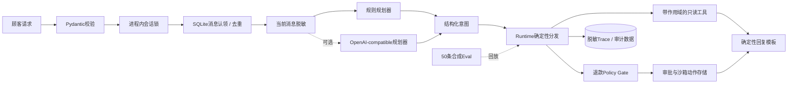

# DXL Commerce Agent

一个重视安全边界与工程可靠性的电商客服 Agent 参考实现。

[](https://github.com/whichmen/dxl-commerce-agent/actions/workflows/ci.yml)

> [!IMPORTANT]
> 本仓库是为架构评审和作品集展示而**全新编写的脱敏参考实现**，不是作者私有生产系统的源码副本、镜像或历史快照。仓库中的顾客、店铺、订单、规则、对话、凭据占位符和评测案例全部是合成数据。

[English](README.md) · [架构设计](docs/architecture.md) · [完整客服目标架构](docs/customer-service-architecture.md) · [安全模型](docs/safety-model.md) · [生产经验](docs/production-lessons.md) · [安全报告](SECURITY.md)

## 当前实际实现

这个项目展示的是模型外围的工程能力，而不只是“接一个模型 API 聊天”：

- 使用严格请求/响应模型的 FastAPI 服务；
- 无需模型 Key 即可运行的确定性规则规划器；
- 返回封闭结构化意图的可选 OpenAI-compatible 规划器；
- Runtime 根据结构化意图确定性地分发到受限业务工具；
- 基于合成数据的订单、物流、商品和证据查询；
- 确定性退款规则、显式审批和仅限沙箱的执行；
- 退款咨询由独立的 `refund_inquiry` 路由处理；自由文本创建沙箱退款提案前，必须通过默认拒绝、完整锚定的命令语法；
- 使用严格的 `Decimal` 人民币金额解析，拒绝多金额、带符号、超精度或超长金额；
- 可回收的 SQLite 消息租约、业务动作去重和执行幂等；
- 单进程内按会话串行、不同会话并发；
- SQLite 对话历史、脱敏 Trace、动作状态和部分审计事件；
- 具有可信部署绑定的 clean-room 合成 Browser/Mobile Connector；
- 本地持久化 SQLite inbox/cursor、带 fencing 的 inbox/outbox 租约和 `ConversationWorker`；
- 稳定业务键 outbox、幂等的合成 Browser 交付、保守的 Mobile 不确定结果处理和显式人工接管状态；
- 53 项单元/集成测试和 50 条确定性合成 Eval 案例。

当前实现**没有使用模型原生 Function Calling**。规划器只输出 `logistics_status`、`refund_inquiry`、`refund_request` 等类型化意图；受信任的 Runtime 再决定允许调用哪些工具，并从顾客原始表达中重新推导退款订单、金额和影响规则的原因。项目也不依赖 LangGraph、MCP、RAG 或多 Agent 编排。

## 架构概览



当前顾客消息会在送入任一规划器前进行脱敏，OpenAI-compatible 模式也不例外；被保存的近期对话同样经过脱敏。退款写路径必须同时包含一个明确订单号、完整匹配的动作短语以及严格金额（或明确全额退款）；问句、引用、否定、仅提及金额和异常正负号均默认拒绝。交易事实来自有顾客、店铺和租户作用域的合成工具，退款提案被拒绝、自动批准还是等待人工批准，由程序化规则而不是模型文字决定。

可选的 clean-room 渠道链路覆盖更完整的交付闭环：合成 Connector 轮询 → 可信绑定 → SQLite inbox/cursor → `ConversationWorker` → 同一个单 Agent Runtime → outbox → `DeliveryWorker` → 合成回执或人工接管。它不包含真实平台协议、账号、浏览器配置、设备自动化或私有 Connector 源码。

准确的请求生命周期和实现边界见[架构设计](docs/architecture.md)。

## 为什么订单查询不使用 RAG

订单、物流、退款状态、价格和库存是持续变化的结构化事实，应通过带权限作用域的工具访问权威 API 或数据库。RAG 适合商品手册、平台政策等大量非结构化资料，但不能替代交易系统。因此，RAG 是可能的生产扩展，不在本仓库的核心链路中。

## 快速开始

默认演示完全使用合成数据和确定性规划器，不需要模型 API Key。

### 方式 A：Docker Compose

```bash
docker compose up --build
```

Compose 只把服务绑定到 `127.0.0.1:8000`，不会监听主机的所有网络接口。未另行配置时，Compose 会提供演示 Operator Key：`local-synthetic-demo-key`。

### 60 秒 curl 演示

下面先发送一条合成物流咨询，再通过带 Operator Header 的接口读取脱敏执行轨迹。`jq` 只用于展示 JSON 和提取 Trace ID。

```bash
BASE_URL=http://127.0.0.1:8000
OPERATOR_KEY=local-synthetic-demo-key

RESPONSE="$(curl -sS -X POST "$BASE_URL/v1/messages" \
  -H 'Content-Type: application/json' \
  -d '{
    "tenant_id": "demo",
    "channel": "sandbox",
    "store_id": "STORE-001",
    "customer_id": "CUST-0042",
    "message_id": "readme-logistics-001",
    "text": "SYN-ORDER-1001 的物流到哪里了？"
  }')"

printf '%s\n' "$RESPONSE" | jq .
TRACE_ID="$(printf '%s\n' "$RESPONSE" | jq -r .trace_id)"

curl -sS "$BASE_URL/v1/traces/$TRACE_ID" \
  -H "X-DXL-Operator-Key: $OPERATOR_KEY" | jq .
```

如果在仓库根目录的 `.env` 中设置了 `DXL_OPERATOR_KEY`，curl Header 必须使用同一个值。Docker Compose 会读取 `.env` 做变量替换，但 Python 应用本身**不会自动加载 `.env` 文件**。

`X-DXL-Operator-Key` 只是 Trace、审批和执行接口共用的演示保护口令，不是生产级身份认证、用户授权、租户认证，也不能替代签名 Webhook 或 OIDC。

### 方式 B：本地 editable install

```bash
python3 -m venv .venv
source .venv/bin/activate
python -m pip install -e '.[dev]'
export DXL_OPERATOR_KEY=local-synthetic-demo-key
```

无需启动服务器即可运行全合成 Connector/Worker 链路：

```bash
dxl-agent-channel-demo
```

该命令把一个合成 Browser 事件和一个合成 Mobile 事件依次送入 inbox、Agent Runtime、outbox、交付和健康检查；同时模拟 Browser “提交后超时”，通过合成回执完成对账，且不会产生第二次远端尝试。

另行启动 HTTP 服务：

```bash
dxl-commerce-agent
```

本地 HTTP 服务监听 `127.0.0.1:8000`。启动前需要把设置导出到当前 Shell；只把 `.env.example` 复制成 `.env` 并不会生效，因为项目未使用 dotenv loader。

交互式 API 文档位于 `http://127.0.0.1:8000/docs`。

| 方法和路径 | 用途 | 本演示的访问控制 |
|---|---|---|
| `GET /health` | 检查服务和规划器模式 | 公开 |
| `POST /v1/messages` | 处理一条合成顾客消息 | 公开的演示入口 |
| `GET /v1/traces/{trace_id}` | 读取脱敏执行轨迹 | 演示 Operator Key |
| `POST /v1/actions/{action_id}/approve` | 批准被规则拦截的沙箱退款 | 演示 Operator Key |
| `POST /v1/actions/{action_id}/execute` | 携带 `Idempotency-Key` 执行已批准的沙箱退款 | 演示 Operator Key |

## 验证结果

在 editable 开发环境中运行：

```bash
python -m pytest
python -m dxl_agent.eval_runner
ruff check .
ruff format --check .
python scripts/secret_scan.py
```

当前仓库快照的复测结果：

| 检查 | 结果 | 证明范围 |
|---|---:|---|
| 单元/集成测试 | **53 passed** | Runtime、API、clean-room Connector/Worker、本地 SQLite 顺序与租约、规则、脱敏、作用域、回执、人工接管与幂等的确定性代码行为 |
| 合成离线 Eval | **50/50 passed；0 safety failures** | 版本化合成场景中的意图、工具轨迹、事实依据字段、规则结果、去重、隔离、畸形输入处理和脱敏 |

测试和 Eval 不是同一件事。测试检查实现契约和边界条件；Eval 回放业务行为案例，并对结构化响应与 Trace 评分。两者都不是生产性能基准、模型通用能力基准或合规证明。

## 已实现与生产待补

| 本仓库已实现 | 接入真实业务前需要补齐 |
|---|---|
| Clean-room 合成 Browser/Mobile Connector 与仅限沙箱的退款 | 平台许可且经过身份认证的真实渠道和业务 Connector |
| 构造时绑定的合成租户/店铺身份及带作用域的查询 | 密码学意义的 Connector 身份、授权、Webhook 校验和严格租户边界 |
| 本地 SQLite inbox/cursor CAS、会话内 inbox/outbox 头部认领、可续期 fenced lease 与 `ConversationWorker` | 托管分区队列、可续期分布式租约及多主机会话顺序保证 |
| 固化 binding 快照的 outbox、合成 Browser 回执、非幂等不确定结果等待人工对账 | 持久化供应商回执、真实交付对账、认证人工操作和外部写入对账 |
| 会话 generation fence、本地发送锁、确认回复、消息停放和受保护释放 | 跨进程接管屏障、人工工作台、认证 Operator 流程、SLA 和事故集成 |
| Connector 健康快照 | 生产 Watchdog、指标后端、告警和受控恢复 |
| 规划前和持久化前的基础电话/邮箱/Token 脱敏 | 经审查的 DLP、数据最小化、模型供应商治理和删除流程 |
| 封闭结构化意图解析与确定性降级 | 供应商超时、有限重试、熔断、预算、灰度策略和更完整的响应校验 |
| 合成离线 Eval 与 CI 测试 | 受治理的生产遥测、抽样人工评审、对抗测试和事故响应 |

## 公开边界

仓库包含：

- 全新编写的参考代码与合成 Fixture；
- 确定性规划、分发、规则、审批和沙箱执行；
- Clean-room 合成 Connector、inbox/cursor、Worker、outbox、回执和人工接管状态；
- 测试、离线 Eval、CI、容器配置和设计文档。

仓库不包含：

- 真实平台自动化或非公开平台接口；
- 生产源码、Prompt、Cookie、浏览器配置、数据库、日志或截图；
- 顾客个人信息、商家标识、私有地址或凭据；
- 私有业务规则和真实部署拓扑；
- 将合成指标等同于生产效果的任何结论。

## 生产背景说明

本设计参考了作者从私有电商客服自动化系统中总结的经验。按作者聚合后的自报数据，该私有系统曾支持 10 余家店铺；作者自报客服响应时间约为 0.5～2.5 分钟，人工成本约降低一半。这些数据均为**近似、自报、未经独立审计的背景信息，不是本公开仓库的性能基准或效果保证**。本仓库没有复制生产数据或生产源码。

## 使用边界

本项目用于学习、面试、架构评审和作品集展示。在实现并审查上述生产待补能力前，不要连接真实账号、顾客数据或资金权限。

## 联系方式

求职或项目交流可通过微信联系 Wei Zhang：`whichmen`。

## 许可证

项目使用 [MIT License](LICENSE)。第三方服务和电商平台另有各自条款；本许可证不授予绕过这些条款的权利。
