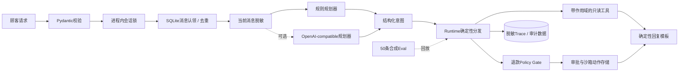

# DXL Commerce Agent

这是我做的一套可直接运行、方便二次开发的电商售前售后 Agent 工程。它把消息接入、意图规划、订单与物流查询、退款风控、可靠投递、人工接管、执行追踪和离线 Eval 串成了一条完整链路。

[](https://github.com/whichmen/dxl-commerce-agent/actions/workflows/ci.yml)

[English](README.md) · [架构设计](docs/architecture.md) · [完整客服目标架构](docs/customer-service-architecture.md) · [安全模型](docs/safety-model.md) · [生产经验](docs/production-lessons.md) · [安全报告](SECURITY.md)

## 这套系统能做什么

它不只是接一个模型 API 聊天，而是把客服消息从进来到回复发出去的完整流程做了出来：

- **售前问答**：查询商品名称、材质、护理方式、库存和价格；资料不全时主动追问，不凭空编答案；
- **订单与物流**：按顾客、店铺和租户范围查询订单状态和最新物流轨迹；
- **售后处理**：区分“咨询退款规则”和“明确申请退款”，校验订单、金额、原因和证据；
- **退款风控**：证据不足或超出政策范围的动作直接拒绝，达到人工审批阈值的动作进入人工审批，模型不能直接碰资金操作；
- **多渠道接入**：把浏览器端、手机端和 HTTP/API 消息统一成同一种事件，再交给 Runtime 处理；
- **可靠执行**：消息去重、幂等、会话内有序、失败恢复、发送回执核对，避免同一条回复或退款重复执行；
- **人工接管**：复杂或结果不确定的对话可切给人工，接管后会拦住已经排队的旧自动回复；
- **排查与评估**：保存脱敏 Trace、动作和审计记录，并用自动化测试与离线 Eval 回放固定业务场景。

## 支持的平台和接入方式

我在实际项目里做过 **淘宝、拼多多、抖音电商、快手电商、小红书、微信视频号** 的客服自动化适配，覆盖浏览器端和手机端消息处理。

| 平台或渠道 | 当前说明 |
|---|---|
| 淘宝、拼多多、抖音电商、快手电商、小红书、微信视频号 | 我有实际项目适配经验；接入新商家时，需要根据商家权限、页面流程和平台规则定制对应 Connector |
| Browser Connector | 仓库内有完整接口、绑定、轮询、回执和异常处理实现，默认连接本地数据，可替换成经过授权的平台适配器 |
| Mobile Connector | 仓库内有完整接口和不确定发送结果的保护逻辑，默认连接本地数据，可按设备和业务流程扩展 |
| HTTP/API | FastAPI 消息入口可直接运行，也可以接客服工作台、ERP、OMS、物流、商品和知识库服务 |

公开仓库不需要任何真实账号就能跑通完整链路。真实平台的账号、Cookie、私有接口和顾客数据不放在 GitHub；正式接入时沿现有 `ChannelConnector` 和 `CommerceTools` 接口对接经过授权的渠道与业务系统。

## 快速运行

想快速看效果，可以直接运行：

```bash
python3 -m venv .venv
source .venv/bin/activate
python -m pip install -e '.[dev]'
dxl-agent-channel-demo
```

它会完整跑一遍：本地消息进入 Connector，写入 inbox，交给 Agent Runtime 处理，生成回复写入 outbox，再由 Delivery Worker 发送并核对结果。整个过程不需要模型 API Key，也不需要连接外部账号。

## 技术实现

这个项目不只是“接一个模型 API 聊天”，我把客服系统外围真正容易出问题的部分也做了出来：

- 用 FastAPI 接收请求，并用严格的数据模型校验输入和输出；
- 默认使用不需要模型 Key 的规则规划器，也可以切换到 OpenAI-compatible 规划器；
- 规划器只返回固定格式的意图，Runtime 再决定能调用哪些业务工具；
- 用可替换的 `CommerceTools` 接口完成订单、物流、商品和证据查询，默认数据可以直接运行；
- 把退款规则、人工审批和沙箱执行拆开，避免模型直接做高风险操作；
- 退款咨询单独走 `refund_inquiry`，真正创建退款提案时必须满足明确的命令格式；
- 用严格的 `Decimal` 解析人民币金额，拒绝多金额、正负号异常、精度过高或内容过长的输入；
- 用 SQLite 保存消息、动作、对话历史、脱敏 Trace 和部分审计记录；
- 用租约、fencing、业务键去重和幂等处理重复消息、Worker 中断和重复执行；
- 同一个会话按顺序处理，不同会话可以并发；
- 实现 Browser/Mobile Connector 协议，并给 Connector 绑定可信的租户和店铺信息；
- 做了持久化 inbox/cursor、`ConversationWorker`、outbox 和 `DeliveryWorker`；
- Browser 交付支持幂等和回执核对；Mobile 遇到无法确认的发送结果时不会盲目重发，而是转人工处理；
- 人工接管时会阻止旧的自动回复继续发送，解除接管也有状态保护；
- 目前有 53 项单元/集成测试和 50 条确定性合成 Eval 案例。

核心技术栈包括 **Python 3.11、FastAPI、Pydantic v2、asyncio、SQLite、Agent Runtime、结构化意图、确定性 Tool Router、Policy Gate、Human-in-the-loop、持久化 inbox/outbox、fenced lease、幂等键、脱敏 Trace、pytest、Ruff、Mypy、Docker Compose 和 GitHub Actions**。

| 技术点 | 在系统里解决什么问题 |
|---|---|
| Agent Runtime + 结构化意图 | 把模型输出限制成固定业务意图，由可信代码决定工具和动作 |
| 规则 Planner + OpenAI-compatible Planner | 没有模型 Key 也能运行，需要时可切换私有或兼容模型服务 |
| FastAPI + Pydantic v2 | 提供 HTTP 服务并严格校验消息、Trace、审批和执行数据 |
| `ChannelConnector` + `CommerceTools` | 把平台接入和订单、物流、商品等业务系统从核心 Runtime 中拆开 |
| asyncio + 会话锁 | 同一顾客会话按顺序处理，不同会话可以并发 |
| SQLite + inbox/outbox | 消息、动作、历史和投递状态持久化，进程重启后可以继续处理 |
| CAS cursor + fenced lease | 防止多个 Worker 重复认领任务，并支持超时后的安全恢复 |
| 业务键去重 + Idempotency-Key | 防止重复消息、重复回复和重复退款动作 |
| Policy Gate + Human-in-the-loop | 退款等高风险动作先过确定性规则，需要时进入人工审批 |
| 脱敏 Trace + 审计记录 | 方便定位每一步调用，同时减少电话、邮箱和 Token 泄露 |
| pytest + 离线 Eval + CI | 持续回放业务场景，检查代码、工具路径、回复事实和安全规则 |
| Docker Compose | 一条命令启动本地服务，方便部署和继续扩展 |

这个版本**没有使用模型原生 Function Calling**。规划器只输出 `logistics_status`、`refund_inquiry`、`refund_request` 等固定类型的意图，受信任的 Runtime 再选择工具，并从顾客原话里重新确认退款订单、金额和退款原因。这样做的重点是让高风险动作的权限始终掌握在普通代码里，而不是交给模型自由决定。

项目目前也没有使用 LangGraph、MCP、RAG 或多 Agent。这里的重点是把单 Agent 的调用边界、消息可靠性、退款安全和失败恢复先做好，而不是为了堆技术名词增加复杂度。

## 整体是怎么跑的



顾客消息在进入规划器前会先脱敏，保存到对话历史里的内容也会脱敏。退款写操作必须同时包含明确订单号、完整匹配的动作短语，以及严格格式的金额或“全额退款”。问句、引用、否定、只提金额和正负号异常都会被拒绝。

订单、店铺和租户范围由工具侧控制。退款是被拒绝、自动批准还是等待人工批准，也由代码规则决定，不会只听模型生成的一句话。

渠道链路是：Connector 轮询 → 校验绑定 → SQLite inbox/cursor → `ConversationWorker` → 单 Agent Runtime → outbox → `DeliveryWorker` → 回执核对或人工接管。

仓库默认使用本地 Browser/Mobile Connector 和内置数据，因此 clone 后不依赖外部平台也能复现消息接入、处理、投递和故障恢复。接入真实业务时替换适配层即可，核心 Runtime、Worker、幂等和风控逻辑不需要跟着每个平台重写。更详细的调用过程见[架构设计](docs/architecture.md)。

## 为什么订单查询没有用 RAG

订单、物流、退款状态、价格和库存一直在变化，应该通过有权限控制的 API 或数据库读取真实数据。RAG 更适合商品手册、平台政策、售后说明这类大量非结构化资料，不能替代订单系统。

需要接商品手册、平台政策和售后说明时，可以在资料检索层增加 RAG；订单、物流、库存和资金动作仍然走有权限控制的 API 或数据库。核心链路没有为了堆技术名词硬塞 RAG。

## 怎么运行

默认运行方式使用内置数据和规则规划器，不需要模型 API Key。

### 方式 A：Docker Compose

```bash
docker compose up --build
```

Compose 只监听 `127.0.0.1:8000`，不会对外开放主机的全部网络接口。没有另外设置时，本地 Operator Key 是 `local-synthetic-demo-key`。

### 用 curl 跑一条消息

下面会发送一条合成物流咨询，再用 Operator Header 读取脱敏后的执行轨迹。`jq` 只负责格式化 JSON 和取出 Trace ID。

```bash
BASE_URL=http://127.0.0.1:8000
OPERATOR_KEY=local-synthetic-demo-key

RESPONSE="$(curl -sS -X POST "$BASE_URL/v1/messages" \
  -H 'Content-Type: application/json' \
  -d '{
    "tenant_id": "demo",
    "channel": "sandbox",
    "store_id": "STORE-001",
    "customer_id": "CUST-0042",
    "message_id": "readme-logistics-001",
    "text": "SYN-ORDER-1001 的物流到哪里了？"
  }')"

printf '%s\n' "$RESPONSE" | jq .
TRACE_ID="$(printf '%s\n' "$RESPONSE" | jq -r .trace_id)"

curl -sS "$BASE_URL/v1/traces/$TRACE_ID" \
  -H "X-DXL-Operator-Key: $OPERATOR_KEY" | jq .
```

如果在仓库根目录的 `.env` 里设置了 `DXL_OPERATOR_KEY`，curl Header 也要使用同一个值。Docker Compose 会读取 `.env` 做变量替换，但 Python 应用本身**不会自动加载 `.env` 文件**。

`X-DXL-Operator-Key` 是本地运行时给 Trace、审批和执行接口共用的保护口令。正式部署时需要换成完整的登录、授权和租户认证，渠道入口还要增加签名 Webhook 或相应的身份校验。

### 方式 B：本地安装

```bash
python3 -m venv .venv
source .venv/bin/activate
python -m pip install -e '.[dev]'
export DXL_OPERATOR_KEY=local-synthetic-demo-key
```

不启动 HTTP 服务，也可以单独跑完整的合成 Connector/Worker 链路：

```bash
dxl-agent-channel-demo
```

这个命令会处理一个合成 Browser 事件和一个合成 Mobile 事件。它还会模拟 Browser“已经提交，但客户端超时”的情况，再通过合成回执确认发送成功，避免发第二遍。

启动 HTTP 服务：

```bash
dxl-commerce-agent
```

服务监听 `127.0.0.1:8000`。启动前需要把设置导出到当前 Shell；只把 `.env.example` 复制成 `.env` 不会生效，因为项目没有使用 dotenv loader。

交互式 API 文档在 `http://127.0.0.1:8000/docs`。

| 方法和路径 | 用途 | 默认访问控制 |
|---|---|---|
| `GET /health` | 检查服务和规划器模式 | 公开 |
| `POST /v1/messages` | 处理一条本地顾客消息 | 本地入口 |
| `GET /v1/traces/{trace_id}` | 读取脱敏执行轨迹 | Operator Key |
| `POST /v1/actions/{action_id}/approve` | 批准被规则拦截的沙箱退款 | Operator Key |
| `POST /v1/actions/{action_id}/execute` | 携带 `Idempotency-Key` 执行已批准的沙箱退款 | Operator Key |

## 我怎么验证它

在 editable 开发环境中运行：

```bash
python -m pytest
python -m dxl_agent.eval_runner
ruff check .
ruff format --check .
python scripts/secret_scan.py
```

当前代码的复测结果：

| 检查 | 结果 | 能说明什么 |
|---|---:|---|
| 单元/集成测试 | **53 passed** | Runtime、API、合成 Connector/Worker、本地 SQLite 顺序与租约、规则、脱敏、权限范围、回执、人工接管和幂等按预期工作 |
| 合成离线 Eval | **50/50 passed；0 safety failures** | 50 个固定场景里的意图、工具轨迹、事实字段、规则结果、去重、隔离、异常输入和脱敏符合预期 |

测试和 Eval 不是一回事。测试主要检查代码和边界情况，Eval 是把业务案例重新跑一遍，再检查结构化回复与 Trace。它们都不能证明生产性能、模型通用能力或合规性。

## 现有能力与正式接入点

| 仓库内已经实现 | 按实际业务接入 |
|---|---|
| 重新编写的合成 Browser/Mobile Connector 和沙箱退款 | 平台允许并且经过认证的真实渠道和业务 Connector |
| 构造时绑定的合成租户/店铺身份，以及有范围限制的查询 | 真实 Connector 身份认证、授权、Webhook 校验和严格租户隔离 |
| 本地 SQLite inbox/cursor CAS、会话内 inbox/outbox 顺序、可续期 fenced lease 和 `ConversationWorker` | 托管分区队列、分布式租约和多机器之间的会话顺序保证 |
| 保存 binding 快照的 outbox、合成 Browser 回执，以及 Mobile 不确定结果转人工 | 真实平台回执、交付对账、认证人工操作和外部写入核对 |
| 会话 generation fence、本地发送锁、确认回复、消息停放和受保护释放 | 跨进程接管屏障、人工工作台、认证 Operator 流程、SLA 和事故处理 |
| Connector 健康状态 | 生产 Watchdog、指标系统、告警和受控恢复 |
| 写入规划器和数据库前的基础电话、邮箱、Token 脱敏 | 经过审查的 DLP、数据最小化、模型供应商管理和删除流程 |
| 固定格式的意图和确定性降级 | 供应商超时、有限重试、熔断、预算、灰度和更完整的回复校验 |
| 合成离线 Eval 和 CI 测试 | 线上指标、抽样人工复查、对抗测试和事故响应 |

## 仓库内容与接入边界

仓库提供：

- 可直接运行的 Agent Runtime、Worker、Connector 协议和内置 Fixture；
- 规划、分发、规则、审批和沙箱执行；
- 合成 Connector、inbox/cursor、Worker、outbox、回执和人工接管状态；
- 测试、离线 Eval、CI、容器配置和设计文档。

公开仓库不会预置某个商家的私有内容：

- 经过商家授权的真实平台适配器或官方平台接口；
- 生产源码、Prompt、Cookie、浏览器配置、数据库、日志或截图；
- 顾客个人信息、商家标识、私有地址或凭据；
- 私有业务规则和真实部署拓扑；
- 把合成指标说成生产效果的结论。

## 我之前做过的实际业务

我实际做过覆盖 **淘宝、拼多多、抖音电商、快手电商、小红书和微信视频号** 的私有电商客服自动化系统，包括售前、售后、浏览器端和手机端处理。

按我的实际运行记录，这套私有系统支持过 10 多家店铺，基础售前、售后客服工作实现了自动处理，客服响应时间通常在 0.5～2.5 分钟，整体人工成本降低约一半。这里列的是我对实际业务的汇总，不是公开仓库的压测结果。

## 适用场景

- 下载后在本机跑通完整客服 Agent、Connector 和 Worker 链路；
- 作为电商客服系统的二次开发底座，接入自己的平台、店铺和业务系统；
- 验证订单/物流查询、退款规则、人工审批、幂等投递和人工接管流程；
- 增加商品知识库/RAG、客服工作台、监控告警和多机器部署；
- 用自动化测试与 Eval 持续检查客服回复、工具调用和安全规则。

## 联系我

技术交流或其他问题联系我，微信：`whichmen`。

## 许可证

项目使用 [MIT License](LICENSE)。第三方服务和电商平台有各自的使用条款，MIT License 不代表可以绕过这些条款。
