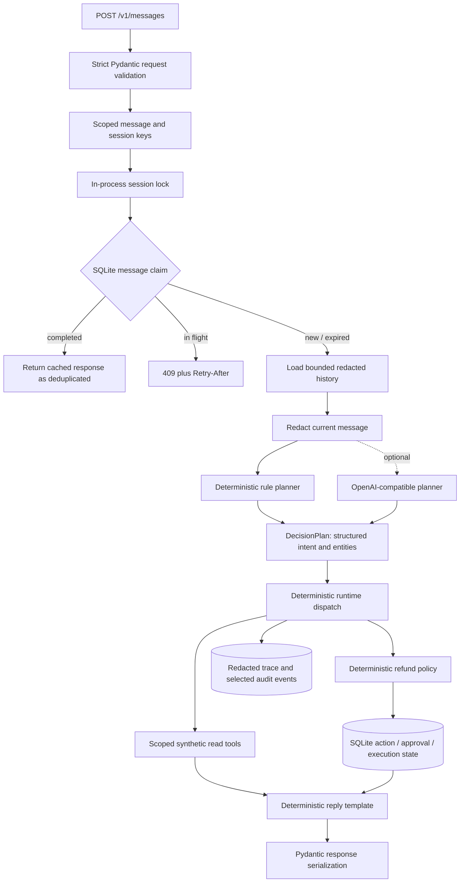

# Architecture

## Purpose and evidence boundary

DXL Commerce Agent is a small, fresh, sanitized reference implementation for a commerce-support Agent Runtime. It separates four concerns that are often blurred in demos:

1. intent planning;
2. authoritative business facts;
3. deterministic permission and policy decisions;
4. delivery reliability and inspectable execution state.

The repository was newly written around synthetic fixtures. It contains no copied production source, customer data, credentials, platform connector, or private deployment topology.

## What the current code actually does



This is **structured intent plus deterministic runtime dispatch**, not native Function Calling. Neither planner sends a tool call to the runtime. Instead, it returns a `DecisionPlan`; trusted Python code maps the intent to a fixed path and supplies trusted tenant/store/customer context to the tool methods.

The optional model is an intent planner, not an autonomous tool executor or response writer. Its output is parsed into known intent/entity fields. Transport or parse errors fall back to the deterministic rule planner. The final customer response is currently composed by deterministic templates.

## Implemented components

### FastAPI ingress

`POST /v1/messages` validates a strict envelope containing tenant, channel, store, customer, message, text, and synthetic evidence IDs. Unknown request fields are rejected. The endpoint itself is open because this is a local demo, not an authenticated channel integration.

Trace, approval, and execution endpoints require `X-DXL-Operator-Key`. This is a shared demo key checked with constant-time comparison. It is not an identity provider, role model, tenant authorization system, or production authentication design.

### Scoped keys and message deduplication

Session and message keys are SHA-256 hashes of canonical JSON tuples. Tenant, channel, store, customer, and message identifiers are kept as separate tuple elements so attacker-controlled delimiters cannot make two scopes collide.

Within one process, messages for the same session acquire the same `asyncio.Lock`; unrelated sessions may proceed concurrently. Before planning, the runtime atomically claims the scoped message key in SQLite. A completed replay returns the stored response with `deduplicated=true`; another worker encountering an active claim fails fast and the API returns `409` with `Retry-After: 1`. A claim abandoned by a crashed worker can be reclaimed after its 60-second lease expires.

The local lease protects an exact message ID for processes sharing the same SQLite file. It does not serialize different message IDs in one session across processes, renew a long-running claim, provide distributed queueing, or coordinate multiple hosts. Those are production-next capabilities.

### Redaction and bounded history

The runtime loads a bounded number of recent turns. Phone numbers, email addresses, and token-like strings are redacted before user text is persisted. The **current message is also redacted before either planner receives it**, including in OpenAI-compatible mode. Recent history supplied to the model comes from that redacted store and is further length-bounded.

This is a small demonstrator, not a complete DLP system. Addresses, names, arbitrary identifiers, images, and many secret formats require broader production controls.

### Planners

Both planners implement the same asynchronous contract:

- **RuleBasedPlanner** deterministically classifies a small set of Chinese/English demo phrases and extracts synthetic order/SKU identifiers.
- **OpenAICompatiblePlanner** calls a configurable chat-completions endpoint for a JSON intent/entity decision. Known fields are parsed into `DecisionPlan`; invalid transport, JSON, intent, order ID, or SKU output falls back to rules.

The model adapter does not use native function calling, does not execute tools, and is not exercised by the deterministic offline Eval suite. Authorization never depends on which planner is selected.

### Deterministic runtime dispatcher

The runtime maps each intent to a fixed implementation path:

- greetings, unsupported requests, unknown requests, and detected injection markers return fixed safe responses without tools;
- order status performs a scoped order lookup;
- logistics first performs a scoped order lookup, then uses its trusted order result for shipment lookup;
- product questions perform a tenant/store-scoped SKU lookup;
- refund inquiries return a fixed explanation without reading an order or creating an action;
- refund requests perform scoped order and, when required, evidence lookups before policy evaluation.

For refunds, the runtime requires exactly one synthetic order ID explicitly present in the current customer message and a full match against a closed action-command grammar. Questions, quoted examples, negations, bare amount mentions, and suspicious signed amounts do not enter the write path. Explicit CNY amounts are parsed with `Decimal`, never binary floating point; multiple, signed, over-precise, or oversized amounts fail closed. The runtime re-derives the amount and policy-relevant reason from the message and does not trust the planner's order, amount, or reason fields. This limits the impact of an unsafe or mistaken planner classification.

### Synthetic commerce tools

`CommerceTools` reads immutable synthetic JSON fixtures. Order and evidence lookup require matching tenant, store, customer, and order scope. Product lookup requires matching tenant and store. Logistics lookup is reached only after the dispatcher obtains an order through the scoped order tool.

These are in-process fixture tools, not live commerce adapters, MCP tools, or production APIs.

### Refund policy and side-effect state

The TOML-backed `PolicyEngine` deterministically evaluates:

- existing pending/succeeded refund state;
- positive amount;
- verified paid amount;
- configured maximum;
- required verified synthetic evidence;
- the automatic-approval limit.

The result is `allow`, `deny`, or `require_approval`. An allowed proposal is stored in `approved` state; a higher allowed amount is stored as `pending_approval`; a denial creates no action.

One SQLite action is retained per scoped refund business key `(tenant, store, customer, order)`. Repeated messages proposing another refund for that order reuse the persisted action rather than creating another one.

### Approval and sandbox execution

Approval changes a pending action to `approved`. Execution requires both the demo operator key at the API boundary and a caller-provided `Idempotency-Key`. SQLite uses `BEGIN IMMEDIATE`, state checks, and unique indexes so the included concurrency test shows two connections cannot execute the same action twice.

Reusing the original idempotency key returns the recorded result. Trying a different key after success returns a conflict. The backend is a synthetic local executor that returns a synthetic refund ID; there is no real payment or platform call.

The reference code does **not** implement uncertain-timeout reconciliation with an authoritative external backend. That belongs in production-next work.

### Trace and audit data

Each new handled message persists a structured trace containing the hashed public session ID, intent, status, tool steps, policy/action steps, selected public arguments, latency for local planner/tool calls, and named grounding fields. SQLite also records selected audit events for trace creation and action proposal/approval/execution.

This is useful for demonstration and Eval, but it is not an immutable enterprise audit system. There is no trace search UI, external telemetry pipeline, signed log, retention policy, or role-based audit access.

### Response construction

Customer replies are deterministic templates populated from tool/policy results. FastAPI validates the returned response shape through its response model. There is no separate, complete semantic response validator that proves every natural-language claim against provenance; adding one would be production-next work if responses become model-generated.

## Exact request lifecycle

1. FastAPI validates a synthetic request envelope.
2. The runtime derives collision-resistant scoped message and session keys.
3. The session acquires its in-process lock.
4. The runtime atomically claims the message in SQLite; a completed duplicate is replayed, an active duplicate receives a retryable conflict, and an expired claim may be reclaimed.
5. The runtime loads bounded, already-redacted history.
6. The runtime redacts the current message before invoking the selected planner.
7. The planner returns a structured `DecisionPlan`.
8. Trusted runtime code selects the fixed path and supplies scoped tool arguments.
9. Read tools return facts from synthetic fixtures.
10. A refund request enters deterministic policy evaluation and may create or reuse one sandbox action.
11. A deterministic template constructs the reply.
12. The redacted user turn, assistant turn, trace, selected audit event, cached response, and completed claim state are committed in one SQLite transaction. On an exception, the owning claim is released.
13. Approval and execution, when requested later, use separate operator-key-protected endpoints and SQLite state transitions.

## Implemented invariants

The tests and Eval exercise these current invariants:

- transaction replies use values returned by synthetic tools;
- model output never directly invokes a tool or side effect;
- policy-relevant refund facts are not accepted blindly from a planner;
- scoped order/product/evidence lookups do not return another fixture customer's or store's data;
- exact message replay returns one decision;
- an active cross-connection duplicate fails fast, while an expired message claim can be reclaimed;
- one scoped order has one persisted refund workflow;
- an approved action cannot execute twice, including across two SQLite connections;
- messages in one process are serialized by session;
- current messages and stored history redact the demonstrated phone/email patterns;
- operator endpoints reject missing or incorrect shared demo keys.

These are properties of this bounded synthetic implementation, not claims of production exactly-once delivery, comprehensive privacy protection, or distributed tenant isolation.

## Why one agent loop

Intent recognition and the relevant business action share a small context in this demo. Adding multiple agents would add coordination surface without creating a stronger permission boundary. Independent production workloads—such as proactive logistics monitoring, refund audit, or knowledge maintenance—could later become separate workers with explicit events and permissions.

## Where RAG could fit

RAG is intentionally absent from the transaction path:

```text
mutable structured facts -> authenticated order/logistics APIs
hard constraints          -> versioned policy code/configuration
unstructured guidance     -> optional read-only document retriever
```

A future retriever should return source, tenant, version, and effective-date metadata. Retrieved text remains untrusted evidence and must not grant authority. The current repository does not implement this retriever.

## Implemented vs production-next

| Area | Implemented here | Production-next |
|---|---|---|
| Ingress | Strict synthetic HTTP schema | Authenticated/signed channel adapters, rate limits, replay windows |
| Planning | Rules plus optional structured OpenAI-compatible intent planner | Provider timeout/retry policy, budgets, rollout and model monitoring |
| Dispatch | Fixed intent-to-code paths | Versioned tool registry only if the domain requires it |
| Data | Scoped synthetic fixture lookups | Least-privilege tenant-scoped service APIs |
| Ordering | In-process per-session lock plus fail-fast, expiring SQLite claim for an exact message ID | Durable partitioned queue and renewable distributed lease |
| Writes | SQLite state machine and sandbox idempotency | Authoritative backend operation IDs and ambiguous-result reconciliation |
| Privacy | Basic phone/email/token redaction | Reviewed DLP, encryption, deletion/retention and provider governance |
| Responses | Deterministic grounded templates and API shape validation | Semantic grounding validator if model-generated replies are introduced |
| Observability | Local trace plus selected SQLite audit events | Structured telemetry, access control, retention, alerting, incident workflow |
| Evaluation | 50 deterministic synthetic offline cases | Governed failure sampling, adversarial sets, online monitoring, human review |

Infrastructure should be added in response to measured reliability, scale, privacy, or governance needs—not merely to add framework vocabulary.
