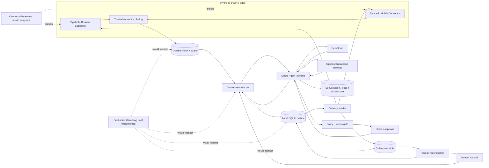

# Complete Customer-Service Clean-Room Architecture

## Status and evidence boundary

This document describes the implemented clean-room customer-service pipeline and the controls still required for production. The public code now includes synthetic Browser/Mobile connectors, a local durable inbox/cursor, workers, an outbox, synthetic receipt reconciliation, and human-handoff state. None of those components connects to a real platform.

Three labels are used throughout:

- **Implemented clean-room** — present in the public repository, fully synthetic, and covered by tests.
- **Production-next** — required before real accounts or multiple production workers can be connected.
- **Production experience boundary** — a private-system pattern described at architecture level without copying its implementation.

The original production browser/mobile adapters, private interfaces, selectors, account sessions, credentials, device details, customer records, and platform-specific payloads were **not copied into this repository**. `BrowserConnector` and `MobileConnector` are newly written in-memory simulators with invented events and safe failure controls.

## Scope

The target system covers a shared customer-service runtime for:

- pre-sales product facts, availability, fit/compatibility questions, clarification, and recommendation;
- order and logistics status;
- post-sales policy inquiry, return/refund proposals, evidence collection, approval, and execution;
- complaints, uncertain cases, and explicit human handoff;
- reliable inbound consumption and outbound delivery across browser-like and mobile-like synthetic channels.

The target is not “full autonomy at any cost.” Transaction truth, authorization, financial policy, delivery state, and human ownership remain deterministic system responsibilities.

## System context



### Current public implementation map

| Capability | Status in this repository |
|---|---|
| Strict normalized HTTP message envelope | **Implemented now** |
| Single planner contract and deterministic runtime dispatch | **Implemented now** |
| Scoped synthetic order/product/logistics/evidence tools | **Implemented now** |
| Refund inquiry/action separation, policy, approval, and sandbox execution | **Implemented now** |
| Local exact-message claim, response cache, trace, and action idempotency | **Implemented now** |
| Synthetic Browser/Mobile Connectors | **Implemented clean-room** with invented in-memory event and delivery behavior |
| Trusted connector-to-tenant/store binding | **Implemented clean-room** as immutable constructor configuration; production authentication is not implemented |
| Durable inbox/cursor and `ConversationWorker` | **Implemented clean-room** in local SQLite with fenced item leases; not a distributed session queue |
| Outbound outbox and receipt reconciliation | **Implemented clean-room** for synthetic connectors; no real provider receipt feed |
| Human takeover workflow | **Implemented clean-room** as session state, handoff event, acknowledgement, parking, and direct release method; no console or operator authentication |
| Connector health snapshot | **Implemented clean-room** through `ConnectorSupervisor` |
| Watchdog, dashboards, alerts, and automated recovery | **Production experience / production-next; not implemented** |

## 1. Synthetic channel connectors

### Synthetic Browser Connector — implemented clean-room

`BrowserConnector` replays invented events into a normalized contract. It advertises capabilities, binds trusted tenant/store/channel fields, enforces outbound length, deduplicates by business and idempotency keys, models timeout-after-commit, and supports in-memory receipt lookup. It contains no real platform URL, endpoint, selector, cookie, browser profile, wire format, or captured payload.

Its inputs are invented `SyntheticInboundEvent` dataclasses constructed by tests and `dxl-agent-channel-demo`; there is no browser process or parser for captured platform traffic.

### Synthetic Mobile Connector — implemented clean-room

`MobileConnector` is an in-memory device-shaped simulator. It models offline and foreground-unavailable states before a remote attempt, confirmed delivery, and an unknown result after an attempt. Because it has neither native idempotency nor receipt lookup, an unknown business key is latched and any replay—including one with a new transport key—returns unknown without another remote attempt.

Both connectors normalize into the same envelope so the Agent Runtime does not contain channel-specific parsing logic. The mobile simulator contains no real account, package detail, device identifier, contact, screenshot, accessibility dump, or production message.

## 2. Trusted tenant and store binding

Tenant, store, channel, and connector identity must come from trusted deployment context, not customer text, model output, or unverified event fields.

In the clean-room implementation, `ConnectorBinding` is immutable constructor configuration:

```text
connector_instance -> tenant_id + channel + store_id + permitted_capabilities
```

Normalization copies connector, tenant, channel, and store identity from that binding, not from `SyntheticInboundEvent.untrusted_metadata`. `ConnectorIngestor` verifies the normalized event still matches its registered binding before persistence. The inbox/outbox retain a fingerprint of the binding and delivery capabilities plus the routed tenant/store/channel snapshot; `DeliveryWorker` rejects a connector that no longer matches that snapshot. This is a useful trust-boundary test, but it is not connector authentication.

Production must authenticate each connector instance, bind its allowed scope server-side, and use per-tenant least-privilege credentials and storage access.

The current public `/v1/messages` API accepts caller-supplied tenant/store/customer fields for a synthetic demo. That is not production identity authentication.

## 3. Local durable inbox and connector cursor

### Implemented clean-room

`ConnectorIngestor` polls from the stored opaque cursor. `ChannelStore.record_poll` uses compare-and-swap on the expected cursor, then atomically inserts the sanitized normalized batch and advances that connector's cursor in local SQLite. A late poll cannot overwrite a newer cursor. A unique `(connector_id, external_event_id)` constraint makes replay idempotent; a normalized payload fingerprint turns “same ID, changed content” into a conflict instead of silently advancing the cursor.

An implemented inbox record carries:

- immutable internal and external event IDs;
- trusted tenant/channel/store binding;
- conversation/customer/message routing fields and derived session key;
- redacted text plus bounded synthetic attachment references;
- capture timestamp, while the connector cursor is stored separately;
- processing state, lease token, attempt count, and next-attempt time.

Workers claim inbox records with 60-second fenced leases and renew them every 20 seconds while work is active. An expired item may be reclaimed, while a stale token cannot complete it. The claim query only exposes the oldest ready/processing row for each session, so connections sharing this SQLite database cannot claim a later message first. Retry exhaustion moves the item to `dead` and activates handoff. This remains a local database design, not a multi-host queue or a proof of ordering after migration to another backend.

## 4. ConversationWorker and ordering

### Implemented clean-room

`ConversationWorker.run_once` claims one inbox item, respects the session's bot/human state, recognizes an explicit synthetic handoff request, and otherwise invokes the existing single Agent Runtime. The item's session key is derived from trusted tenant/channel/store/customer fields.

Its responsibilities are:

1. claim and renew a fenced inbox lease;
2. load bounded conversation/workflow state;
3. stop automatic handling if a human owns the conversation;
4. invoke the single Agent Runtime once;
5. let `AgentRuntime` finalize its turn/trace/cache transaction;
6. atomically mark the inbox complete and insert one stable outbox item in a second SQLite transaction;
7. classify failures as retryable, terminal, or human-review-required.

The two transactions are bridged by the runtime's message cache: a simulated crash before outbox commit replays the cached decision without duplicating conversation turns, then creates the same deterministic outbox key. The worker is orchestration code, not a second reasoning agent.

The demo normally calls workers sequentially, while tests exercise SQLite head-of-line claims and renewal primitives. It does not claim multi-host partition ordering; that remains production-next.

## 5. Single Agent Runtime

### Implemented core

One Agent Runtime receives normalized context and returns a typed disposition. The current repository demonstrates structured intent plus deterministic dispatch; it does not use native model Function Calling or multi-agent debate.

The runtime returns its existing structured response with intent, status, reply, tool calls, policy result, pending action, grounding fields, and trace ID. `ConversationWorker` persists that reply into the outbox. Explicit customer handoff is recognized by the worker before runtime invocation; delivery ambiguity can activate handoff later in `DeliveryWorker`.

The model may help classify intent or draft wording. It cannot establish identity, select an arbitrary capability, approve its own action, or decide that a message was delivered.

## 6. Tools, knowledge, policy, and approval

### Authoritative tools

In the public implementation, mutable facts—orders, logistics, inventory, price, and refund state—come from tenant/store/customer-scoped synthetic tools. The runtime supplies trusted scope outside model-controlled arguments. Read and write capabilities remain separate. Real production tools would additionally require authenticated, least-privilege service access.

### Optional knowledge retrieval

RAG is appropriate for unstructured manuals or policy explanations, not live transaction state. Retrieved passages require tenant, source, version, and effective-date metadata and remain untrusted evidence.

RAG is not implemented in the current repository.

### Policy and approval

Sensitive actions pass deterministic checks for ownership, state transition, amount, evidence, risk limit, and required approval. The current public sandbox demonstrates this boundary for refunds.

A production approval record should contain authenticated operator identity, role, tenant, policy version, proposal hash, decision, timestamp, and reason. The current shared demo operator key is not production identity or authorization.

## 7. Local outbox and outbound idempotency

### Implemented clean-room

The customer reply is not sent inside `ConversationWorker`. After the runtime has finalized its cached decision, `ChannelStore.complete_with_reply` atomically completes the inbox lease and inserts one outbox row with deterministic outbox and delivery keys. A separate `DeliveryWorker` claims and sends it.

Each outbox item has:

- a stable business delivery key;
- connector, tenant, channel, store, session, conversation, and customer routing snapshots;
- response payload or protected reference;
- local state: `ready`, `delivering`, `succeeded`, `dead`, or `unknown`;
- lease/attempt timing;
- platform message reference when available;
- one stored synthetic remote receipt and the latest safe error code.

Reclaiming a worker lease must not create a second logical reply. Repeated attempts reuse the same delivery key, and a channel idempotency primitive is used when one exists. The outbox claim exposes only the oldest `ready` or `delivering` row for a session, so a later reply cannot overtake an earlier delayed retry in the shared SQLite database. An expired `delivering` lease is reclaimable only when its snapshotted connector capability declares native idempotency and its session fence is still current; otherwise it becomes `unknown` and activates handoff.

Inbox completion and outbox insertion are one local SQLite transaction. Agent decision finalization is a separate transaction, with cache replay tested as the recovery bridge. This is not a distributed transactional outbox.

## 8. Delivery receipts and reconciliation

### Implemented clean-room, limited to synthetic connectors

Send-call success and confirmed delivery are modeled as different facts. `DeliveryWorker` interprets the connector's typed delivery disposition. For a Browser unknown result, it immediately calls the synthetic receipt lookup before deciding whether to mark success, retry, or hand off.

Before any send, `DeliveryWorker` recomputes the stored outbox payload hash, verifies the connector binding snapshot and session generation, and checks that returned attempt/receipt idempotency keys match the current lease. The synthetic Browser connector additionally compares:

- the stable idempotency key and connector-computed payload hash;
- its in-memory synthetic attempt record;
- returned platform reference, if any;
- the synthetic connector's in-memory receipt result;

Only a confirmed result moves an outbox row to `succeeded`. `NOT_FOUND_SAFE_TO_RETRY` may requeue only when the connector advertises native idempotency. A generic `RETRYABLE` result may requeue only before a remote attempt or with native idempotency; a post-attempt result without that protection becomes `unknown`. The deterministic `DeliveryWorker`, not the language model, changes delivery state.

There is no asynchronous provider receipt consumer, durable receipt history, or real authoritative message lookup.

## 9. Ambiguous mobile delivery: never retry blindly

### Implemented clean-room safety behavior

A mobile automation call may time out after the application accepted the message. Treating every timeout as failure can send the same reply twice.

The clean-room Mobile connector and `DeliveryWorker` implement the conservative branch:

```text
delivering -> succeeded   (confirmed synthetic send)
delivering -> ready       (failure before any remote attempt; bounded retry)
delivering -> unknown     (result ambiguous after an attempt)
unknown -> human_active   (no safe receipt capability; do not resend)
```

An unknown Mobile result is not automatically resent. The connector latches the semantic business key, and the worker marks the outbox `unknown` and activates human handoff because the synthetic Mobile connector advertises no safe receipt lookup. The same rule applies when a non-idempotent `delivering` lease expires after a process crash: it becomes `unknown`, never `ready`. A direct manual-resolution method can record `confirmed`, `not_sent`, or `cancelled`; automation cannot resume while an unknown item remains. The repository does not implement a real device sender, platform history query, or authenticated operator workflow.

## 10. Human handoff

### Implemented clean-room state; production console absent

The implemented local state is intentionally small:

```text
bot -> human_active -> bot
```

An explicit “transfer to a person” message atomically activates `human_active`, increments a persistent session generation, records a handoff event, completes the inbox item, freezes queued automatic replies, and enqueues one deterministic acknowledgement. Ambiguous Mobile delivery, missing connector, or retry exhaustion also activates handoff. Later inbound items for the session are parked while human state is active.

`ConversationWorker` and `DeliveryWorker` share a per-session asynchronous lock on one `ChannelStore`; `DeliveryWorker` rechecks the persisted generation immediately before the synthetic send. This forms a tested local send barrier. It is not a cross-process/distributed lock, so production still requires a durable ownership protocol around real remote calls.

`release_handoff` performs only a `human_active` to `bot` transition. A repeated release is idempotent, while any `delivering` or `unknown` outbox item blocks the transition; after explicit resolution or confirmed completion it advances the generation and requeues parked inbound messages. It is a direct store method for tests/demo, not an authenticated operator endpoint. The repository has no human-review console, operator identity, SLA workflow, rich handoff bundle, or production notification integration.

## 11. Production experience boundary

The author reports that the private customer-service system used browser automation/CDP, Appium with UiAutomator2, Android `AccessibilityService`, an image/OCR bridge, a Decision API with delivery acknowledgements, and health/watchdog processes. After-sales action executors were deployed separately from message workers so a delivery worker did not automatically inherit business-write authority.

This paragraph records architecture-level experience only. No platform name, selector, private endpoint, device/account detail, production topology, or original adapter source is published. The public Browser/Mobile connectors are clean-room synthetic simulators and do not implement those production technologies.

## 12. Watchdog and observability

### Production lesson and target design

A Watchdog should observe and alert; it must not silently invent business outcomes. Useful checks include:

- connector heartbeat and cursor age;
- inbox lag, expired leases, attempts, and dead-letter growth;
- per-conversation processing latency;
- planner/tool/policy latency and error class;
- outbox age and items stuck in `delivering` or `unknown`;
- receipt reconciliation lag;
- approval and human-handoff age;
- duplicate suppression and idempotency conflicts;
- redaction failures and audit-sink health.

Dashboards should report p50/p95/p99 latency, throughput, verified resolution rate, handoff rate, delivery confirmation rate, retry rate, and unresolved unknown deliveries. Every metric needs a denominator and time window.

Automated recovery should be limited to safe operations such as renewing/reassigning expired work or restarting a stateless synthetic connector. It must not approve a refund, mark a delivery successful without evidence, or blindly repeat a write.

The current repository has a health endpoint, structured local traces, selected SQLite audit events, and `ConnectorSupervisor` safe health snapshots. The supervisor is not a polling Watchdog and does not alert or restart anything. There is no production metrics backend, alert manager, or recovery controller.

## 13. End-to-end flows

### Pre-sales read flow

```text
synthetic connector event
-> trusted binding
-> durable inbox
-> ConversationWorker
-> intent + scoped product/inventory tools
-> optional policy/manual retrieval
-> grounded response
-> transactional outbox
-> sender + receipt
```

If the product identity or required preference is missing, ask one clarification question. Do not guess a SKU, price, stock value, or policy.

### Post-sales action flow

```text
customer inquiry
-> explain policy without action
-> explicit customer action request
-> scoped order/evidence lookup
-> deterministic policy
-> deny | auto-approved proposal | human approval
-> idempotent backend execution
-> verified result
-> transactional customer reply
-> delivery receipt / reconciliation
```

An approved business action and a delivered customer notification are separate state machines and must be audited separately.

## 14. Failure matrix

| Failure | Safe target behavior | Current public status |
|---|---|---|
| Duplicate inbound event | One inbox record/decision; replay completed result | Implemented in local SQLite plus Agent Runtime cache |
| Inbox worker loses/overruns lease | Active workers renew; an expired lease can be reclaimed; stale token is fenced | Implemented for SQLite; no distributed coordinator |
| Worker fails before runtime decision completes | Requeue with bounded attempts; handoff after exhaustion | Implemented clean-room |
| Worker fails after decision commit but before outbox commit | Cached decision is replayed without duplicate turns; deterministic outbox is then inserted | Implemented and tested with a synthetic crash |
| Model unavailable | Deterministic fallback or handoff | Rule fallback implemented for the optional provider |
| Read tool unavailable | State that the fact is unverified; retry within a bound or hand off | Production hardening needed |
| Business write timeout | Reconcile authoritative operation before retry | Not implemented; current executor is synthetic |
| Browser timeout after synthetic commit | Look up receipt and mark one outbox success without another remote attempt | Implemented clean-room |
| Mobile result unknown or non-idempotent send lease expires | Latch/mark unknown, activate handoff, and never automatically retry | Implemented clean-room with explicit manual resolution |
| Earlier reply enters delayed retry | Keep later same-session outbox rows behind it | Implemented head-of-line in shared SQLite |
| Human takes ownership | Freeze queued replies, recheck generation before send, and park later inbound messages | Implemented local barrier; no cross-process production lock or console/authentication |
| Watchdog unavailable | Core local state still exists; production alert/recovery is absent | Only a one-shot health snapshot is implemented |

## 15. Security and privacy requirements

- authenticate connectors and bind their tenant/store scope server-side;
- keep model-controlled text outside identity and authorization fields;
- minimize and redact content before model calls and telemetry;
- encrypt durable inbox, conversation, outbox, receipt, and approval data;
- use per-tenant least-privilege connector/tool credentials;
- define retention, deletion, legal hold, and operator access controls;
- never publish production conversations as fixtures, even after superficial name replacement;
- use only platform-approved integrations and complete legal/platform review.

## 16. Verification evidence

The 53-test suite now includes clean-room connector, store, and worker contracts without using real services. Covered behavior includes:

- Browser and Mobile events receive binding-derived scope and normalize to the same contract;
- connector cursor and inbox insertion commit idempotently in one SQLite transaction;
- stale concurrent polls fail cursor compare-and-swap, and changed duplicate payloads fail closed;
- expired inbox leases are reclaimed while stale workers are fenced;
- active inbox/outbox leases expose renewal, and later same-session rows cannot overtake an earlier ready/delivering row;
- outbox delivery is leased and one receipt is recorded;
- connector rebinding, payload-hash mismatch, and returned delivery-key mismatch cannot confirm an outbox;
- Browser timeout-after-commit is reconciled without a duplicate remote attempt;
- Mobile offline/foreground failures retry only before a remote attempt;
- a retryable result after a non-idempotent remote attempt is handed off rather than requeued;
- local human ownership cancels a queued automatic reply and permits only the handoff acknowledgement;
- mobile `unknown` never triggers an automatic duplicate;
- an expired non-idempotent delivery remains unknown until explicit resolution, which gates handoff release;
- an explicit handoff parks later messages; release is idempotent and blocked while a reply is delivering or unknown;
- a simulated crash between runtime completion and outbox commit reuses the cached decision without duplicate turns;
- policy denial cannot be bypassed by planner output;
- demonstrated phone/email markers are redacted.

The separate 50-case offline Eval still exercises the deterministic core Agent Runtime rather than the connector pipeline. Neither test suite uses a real account or validates production scalability.

## 17. Production hardening sequence

1. Replace constructor trust with authenticated connector identity and server-side tenant/store authorization.
2. Move local inbox/outbox state to managed storage with partitioned per-session ordering and renewable distributed leases.
3. Implement only platform-approved real connectors behind the tested protocol.
4. Add durable asynchronous receipt ingestion and authoritative reconciliation.
5. Build an authenticated human-review console, approval workflow, SLA, and audited resume controls.
6. Keep after-sales action executors separately authorized and deployed from message delivery workers.
7. Add metrics, dashboards, production Watchdog checks, alerting, and failure drills.
8. Complete privacy, security, compliance, platform, capacity, and rollback reviews before real traffic.

The public implementation already provides externally verifiable FDE and Agent Runtime evidence while keeping real platform automation and private operational details outside the repository.
