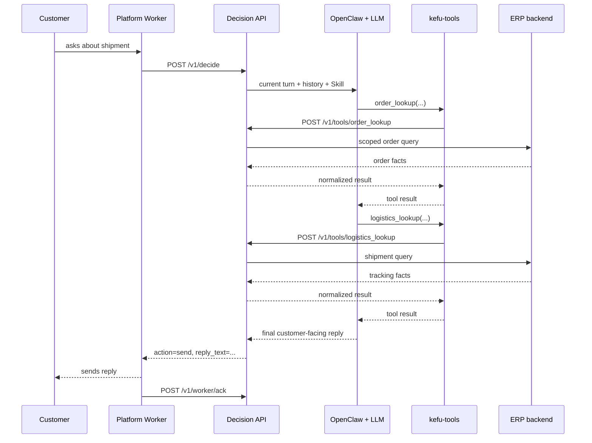

# Customer-Service Flow

This document follows one customer message from a commerce platform to the final delivery receipt. The default business path uses OpenClaw and an LLM; the fixed Policy mode is described separately at the end.

## 1. Platform intake

All six platform adapters produce the same `IncomingMessage` fields: tenant, platform, store, platform nickname, message ID, message type, text/media, timestamp, role, and raw channel metadata.

| Edge | Platforms | Implementation |
|---|---|---|
| Browser | Douyin, Pinduoduo, Kuaishou, WeChat Channels | Authenticated Chrome profile, CDP/Playwright, platform-specific intake and send logic |
| Appium | Taobao Qianniu | Appium + UiAutomator2 page source and element actions |
| Android service | Taobao Qianniu, Xiaohongshu Qianfan | Kotlin `AccessibilityService`, local configuration UI, Decision API client, delivery acknowledgement |

Browser workers keep their own SQLite state for deduplication, turn ordering, send status, and recovery. The Android workers maintain their corresponding device-side state. The shared Python `DecisionClient` and both Android clients use the same `/v1/decide` and `/v1/worker/ack` protocol.

## 2. Decision request

The worker sends:

```json
{
  "event": {
    "tenant_id": "tenant_example",
    "platform": "douyin",
    "store_id": "douyin_store_example",
    "store_name": "Example store",
    "platform_nickname": "customer_example",
    "message_id": "platform-message-id",
    "message_type": "text",
    "text": "Where is my order?",
    "media_url": "",
    "raw": {}
  }
}
```

If `CLAWBOT_API_KEY` is configured, the caller must send the same value in `X-Api-Key`. Platform code obtains that value from private worker configuration; it is not embedded in the worker source.

## 3. Request preparation

The Decision API performs these steps before invoking OpenClaw:

1. Pydantic validates the event.
2. Remote or device-captured image data is materialized under the configured media root when applicable.
3. The service merges trusted channel capabilities, including whether the worker can send an image.
4. It derives a session key from platform, store, and platform nickname.
5. It takes an in-process session lock.
6. It checks the stored decision for the same tenant/platform/store/message ID.
7. It loads up to eight recent customer/agent pairs from SQLite.
8. It records a coarse category for operational metadata.

The classifier in step 8 does not answer the customer and does not replace the model.

## 4. OpenClaw model/tool loop

The Decision API calls the configured `kefu_ops` OpenClaw Agent with:

- platform, store, nickname, message role and channel capabilities;
- the current message;
- bounded recent dialogue;
- original image attachments when they can be loaded safely;
- the rules and skills attached to the `kefu_ops` workspace.

The model then decides whether it already has enough information or needs a tool. A typical logistics turn is:



The model can make zero, one, or several tool calls inside one Agent invocation. The plugin's JSON schemas constrain arguments, while the backend remains responsible for authentication, authorization, business checks, and side-effect limits.

## 5. Tools and business facts

The four default tools cover routine order and after-sales reasoning:

- `order_lookup` resolves an explicit order or a trusted customer identity and returns current order facts;
- `logistics_lookup` returns current shipment summary or trace;
- `refund_history_lookup` returns prior refund/risk information;
- `refund_case_lookup` builds a fact package from after-sales, order, logistics, identity, recent dialogue, and refund records.

The optional tools cover bulk after-sales review, small-refund approval, blacklist changes, offline classification/review, compatibility vision, bounded file reads, and bounded shell operations. Each optional group has a separate registration flag. The Python backend repeats the relevant gate, and file/shell access also requires an allowlist.

Order and logistics data come from the configured ERP adapter. Identity mapping comes from `kefu_identity_service`; its SQLite data can be populated through the admin API or `scripts/import_identity_csv.py`. The special merchant product marker is injected through `CLAWBOT_TARGET_OUTER_ID`, not accepted from the model.

## 6. Image handling

For an image message, the service tries to pass the original local image to OpenClaw as an attachment. If the selected model path rejects attachments, the service can run an isolated image-summary retry and then process that summary in the normal conversation session.

The `kefu-core` skill tells the model not to guess unreadable order IDs or damage evidence. It should ask for a clearer image when it cannot verify the content. The legacy-compatible `image_inspect` tool is off by default because native model vision is the primary path.

Some mobile UI flows use the `/v1/worker/capture_ocr_batch` endpoint to crop screen regions and extract text. OCR can be provided by OpenClaw, Hermes, Qwen vision, or disabled through deployment configuration.

## 7. Reply and delivery

The Agent returns plain text and may emit separate `[[IMAGE_URL:https://...]]` lines. The Decision API:

- rejects an empty result;
- rejects a JSON-looking result so internal structures are not sent to a customer;
- removes image markers from visible text;
- deduplicates image URLs;
- drops images when the current channel does not advertise image-send support;
- stores the event and decision.

The worker validates the action. For `send`, it sends the supported text/images and calls `/v1/worker/ack` with the actual content and delivery status. For `manual`, workers that implement manual mode stop automatic handling for that conversation. `skip` sends nothing.

The current OpenClaw single-reply path normally produces `send` or `skip`; explicit `manual` actions are part of the worker/API protocol and the policy fallback. A deployment that needs a central human queue should add an authenticated operator console and a durable handoff service rather than relying only on customer-facing escalation text.

## 8. Watchdog and recovery

The worker watchdog reads `workers/deploy/workers.watchdog.conf`, starts configured workers, observes their health files, restarts crashed or stale processes, and holds workers that need a login or manual action. systemd units and a path-triggered reload service are included.

The implementation separates three outcomes that should not be confused:

- the model produced a decision;
- the worker attempted to send it;
- the platform send was acknowledged and `/v1/worker/ack` was recorded.

This makes operational investigation much clearer than counting model completions alone.

## 9. Policy fallback

When `CLAWBOT_DECISION_MODE=policy` is explicitly selected, the Decision API bypasses OpenClaw and calls `PolicyEngine`. That path uses keyword/category rules and fixed replies. It is useful for service smoke checks and a controlled fallback, but it cannot replace the natural-language understanding, tool selection, and response writing of the configured LLM.

The default Docker Compose profile selects this mode on purpose. The full flow described above requires a separately configured OpenClaw Gateway, provider, plugin environment, and business-system credentials.
