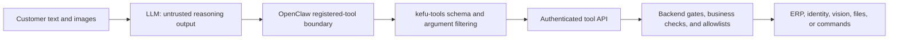

# Safety Model

The system lets an LLM choose tools and write replies, but it does not give the model every capability available on the host. The boundary has four layers: the Agent's tool list, the plugin schema, the authenticated Decision API, and backend business/allowlist checks.

## Trust boundaries

Customer content, model output, and tool arguments are treated as untrusted. Platform login state, API keys, ERP credentials, target product markers, filesystem roots, command allowlists, and write permissions belong to deployment configuration.

## Default model permissions

The `kefu_ops` Agent gets only the `kefu-tools` plugin by default. OpenClaw's general built-in tool group is added only when `CLAWBOT_ENABLE_OPENCLAW_BUILTINS=1` is set before the setup script runs.

Four read-oriented tools are registered without extra feature flags:

- `order_lookup`
- `logistics_lookup`
- `refund_history_lookup`
- `refund_case_lookup`

Nine administrative, write, vision-compatibility, file, or command tools are absent from the model's tool list unless their exact flag is enabled. This matters: a prompt injection cannot call a tool that OpenClaw did not register.

## Plugin argument controls

Every registered tool uses an object schema with `additionalProperties: false`. The plugin also removes model-supplied values named `base_url`, `api_key`, `token`, `secret`, `password`, or `headers` before forwarding a call.

For `refund_case_lookup`, `target_outer_id` is removed from model arguments and replaced only by the trusted `CLAWBOT_TARGET_OUTER_ID` environment value. This prevents a customer message or model decision from changing the deployment's special-order marker.

The plugin calls `CLAWBOT_TOOL_BASE_URL` and supplies `CLAWBOT_TOOL_API_KEY`. Both values must be visible to the OpenClaw Gateway process; use `scripts/sync_openclaw_gateway_env.sh` and restart the gateway after changes.

## Backend gates

The Decision API repeats the important permission checks instead of trusting registration alone:

| Capability | Registration/backend flag | Additional check |
|---|---|---|
| Bulk after-sales query | `CLAWBOT_ENABLE_ADMIN_QUERY_TOOLS` | authenticated tool API |
| Small-refund approval | `CLAWBOT_ENABLE_REFUND_WRITE_TOOL` | order type, paid amount, refund amount, and business-state validation |
| Blacklist add/remove | `CLAWBOT_ENABLE_BLACKLIST_WRITE_TOOLS` | authenticated identity service |
| Offline classification/review | `CLAWBOT_ENABLE_OFFLINE_ADMIN_TOOLS` | bounded input/output handling in backend |
| Compatibility vision | `CLAWBOT_ENABLE_IMAGE_INSPECT_TOOL` | `CLAWBOT_IMAGE_INSPECT_ENABLED`, provider, and provider key |
| Local file read | `CLAWBOT_ENABLE_FILE_READ_TOOL` | `CLAWBOT_FILE_READ_ROOTS` after resolving `..` and symlinks |
| Shell command | `CLAWBOT_ENABLE_SHELL_EXEC_TOOL` | `CLAWBOT_SHELL_ALLOWED_COMMANDS` exact command or safe argument-prefix rule |

Setting an allowlist to `*` deliberately removes the corresponding restriction. Setting the file root to `/` has the same effect for file reads. Those values should only be used inside a separately isolated, disposable environment.

## API keys

The services use different settings for different paths:

- `CLAWBOT_API_KEY` protects decision, prompt, OCR, ops, and delivery-ack routes when non-empty;
- `CLAWBOT_TOOL_API_KEY` protects the tool and intercept routes when non-empty;
- `IDENTITY_API_KEY` protects identity lookup/update and blacklist routes when non-empty;
- optional Enterprise WeChat hub traffic uses its own key and signed callback validation.

Replace every example value and do not reuse one key for all services. An empty key disables the corresponding shared-key check, so empty values are appropriate only for a tightly isolated local process. Shared keys authenticate a service caller; they do not provide individual operator identity, roles, or tenant membership.

## Refund and after-sales actions

The model may decide that a refund tool is relevant, but backend code still controls execution. The included refund-approval tool is limited to the configured after-sales type and small amounts, checks the platform's current refund amount against paid amount, and returns an explicit failure when any condition is not met.

The business Skill also instructs the model to verify the order and evidence before making customer-facing claims. The Skill improves behavior; the backend checks are the actual permission boundary. Any new financial or order-changing tool should follow the same design: separate registration flag, authenticated endpoint, deterministic validation, idempotency/reconciliation, and an audit record.

## File and shell tools

Both tools are off by default. Enabling a tool flag alone is not sufficient.

`CLAWBOT_FILE_READ_ROOTS` accepts Linux `:`-separated roots or a JSON list. The backend resolves the requested target and symlinks before confirming that the real target remains under an allowed root.

`CLAWBOT_SHELL_ALLOWED_COMMANDS` is best supplied as a JSON array. A rule allows the exact command and, for a safe prefix, ordinary whitespace-separated arguments. Shell control syntax in an appended suffix is denied. Do not use broad interpreter entries such as `sh`, `bash`, `eval`, or `python -c` as prefixes.

## Customer and merchant data

The main SQLite database stores customer messages, model replies, event metadata, media references, decisions, and delivery receipts. The identity database stores platform nickname mappings and blacklist state. Browser profiles contain platform cookies. Media capture can include customer screenshots.

These files need normal data controls on a real deployment:

- keep `.env`, CSV mappings, Chrome profiles, SQLite files, media, logs, and Android configuration outside Git;
- restrict their owner and filesystem permissions;
- choose a retention and deletion policy instead of keeping them forever;
- back up only what is needed and encrypt backups where appropriate;
- check the selected model/provider's data handling before sending customer content;
- avoid storing credentials or full customer data in prompts, Skills, source, or issue reports.

The current main path does not perform comprehensive DLP redaction before sending the prompt to the configured model. Deployments handling personal or regulated data should add the required redaction/minimization layer and test it against actual message formats.

## Platform and device boundaries

Browser workers use dedicated Chrome profiles and localhost CDP ports. Android workers require AccessibilityService and, for guard operations, ADB access. These are powerful local permissions.

Run each store/device under a dedicated OS account or container/VM where practical. Do not share one writable browser profile between unrelated workers. Restrict CDP, Decision API, identity API, and ADB to trusted networks or localhost, and use platform-authorized accounts and interfaces.

## What is checked automatically

The current suite includes 72 unit/integration tests, 50 deterministic offline Eval cases, a high-confidence secret scan, Python syntax checks, wheel construction, and container construction. Tests cover the OpenClaw call boundary, request validation, tool registration/authorization, file/shell allowlists, identity service, and existing deterministic reliability components.

CI does not contain a live model account, real platform login, real ERP credential, or Android device. It therefore cannot prove live model quality, platform compatibility, customer-data compliance, or safe behavior for a newly enabled write tool. Those require deployment-specific checks and a staged rollout.
